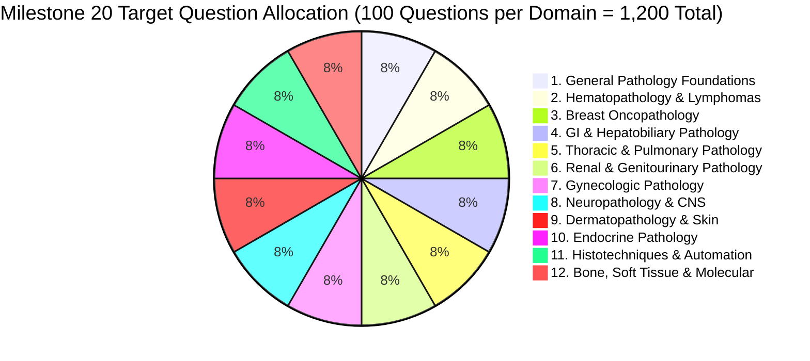
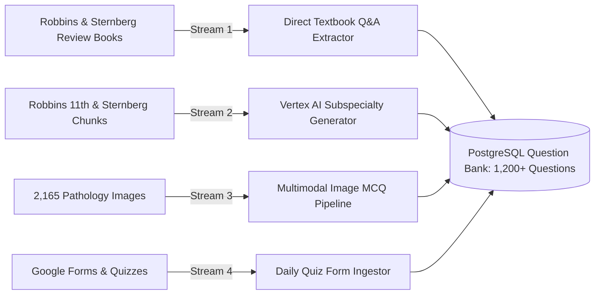

# Milestone 20 — 1,200+ Question Corpus Expansion: 12 Comprehensive Subspecialties (100+ Qs Each)

> **Status**: ACTIVE / PLANNED  
> **Pre-requisite**: Milestones 19C (Embeddings Gate), 19D (Pilot Generation Complete)

---

## 1. Executive Summary & Scale Targets

Milestone 20 scales the medical learning platform to **1,200+ high-yield, evidence-grounded pathology questions** with **at least 100 questions per subspecialty** across all 12 core domains. It fully integrates **General Pathology, CNS, Skin, Endocrine, and Histotechniques & Automation**, with difficulties ranging from foundational MBBS to **`VERY_HARD`** DM / DrNB Oncopathology consultant level.



---

## 2. Difficulty Tier Taxonomy (MBBS to DM / DrNB)

| Difficulty Tier | Target Exam / Level | Cognitive Depth | Clinical Scenario Complexity |
|---|---|---|---|
| **`EASY`** | MBBS 2nd Prof / Foundational | Direct Concept Recall | Clear classic presentation; single definitive textbook fact. |
| **`MEDIUM`** | NEET-PG / Standard MD | Clinical & Diagnostic Application | Realistic patient vignette with standard histopathology or laboratory clues. |
| **`HARD`** | NEET-SS / MD Exit Exam | Multi-Step Reasoning | Complex presentation, multiple competing differential diagnoses, subtle distractors. |
| **`VERY_HARD`** | **DM / DrNB Oncopathology / Consultant** | **Deep Subspecialty Synthesis** | **Discordant IHC panels, rare morphological variants, paradoxical findings, molecular-morphologic integration (e.g. MSI/MMR, NGS fusion markers, WHO 5th classifications).** |

---

## 3. The 12 Subspecialty Blueprints (100+ Questions Each)

### 1. General Pathology Foundations (100 Questions)
* **Key Topics**: Patterns of cell injury and necrosis (coagulative, liquefactive, caseous, fat, fibrinoid), apoptosis cascades (intrinsic vs extrinsic pathways, BCL2 family), cellular adaptations (hyperplasia, metaplasia, dysplasia), acute/chronic inflammation & chemical mediators, tissue repair & angiogenesis, hemodynamic disorders (thrombosis, embolism, shock), genetic & pediatric diseases.
* *Difficulty Split*: 20 Easy, 35 Medium, 30 Hard, 15 Very Hard.

### 2. Hematopathology & Lymphomas (100 Questions)
* **Key Topics**: WHO 5th classification of mature B-cell and T/NK-cell lymphomas, Hodgkin lymphoma subtypes, Acute leukemias (AML with recurrent genetic abnormalities, B-ALL/T-ALL), Myeloproliferative neoplasms (MPN) & Myelodysplastic neoplasms (MDS), Flow cytometry gating strategies, Plasma cell neoplasms, Bone marrow trephine evaluation.
* *Difficulty Split*: 15 Easy, 25 Medium, 35 Hard, 25 Very Hard.

### 3. Breast Oncopathology (100 Questions)
* **Key Topics**: In-situ lesions (DCIS nuclear grading, LCIS vs DCIS), Invasive breast carcinoma histological variants (NST, lobular, tubular, mucinous, metaplastic), ASCO/CAP HER2 IHC & FISH evaluation algorithms, ER/PR Allred scoring, Triple-negative subtypes, Biomarkers (Ki-67, PD-L1, BRCA/HRD), Post-neoadjuvant residual cancer burden (RCB) assessment.
* *Difficulty Split*: 10 Easy, 30 Medium, 35 Hard, 25 Very Hard.

### 4. Gastrointestinal & Hepatobiliary Pathology (100 Questions)
* **Key Topics**: Barrett esophagus dysplasia grading, Gastric adenocarcinoma (Lauren & WHO classifications), Colorectal carcinoma pathways (CIN, MSI-H/MMRd, CIMP/Serrated), Inflammatory bowel disease (Crohn vs UC dysplasia), GIST risk stratification & c-KIT/DOG1, Hepatocellular carcinoma vs adenoma IHC, Pancreatic ductal adenocarcinoma & cystic neoplasms.
* *Difficulty Split*: 10 Easy, 30 Medium, 35 Hard, 25 Very Hard.

### 5. Thoracic & Pulmonary Pathology (100 Questions)
* **Key Topics**: Non-small cell lung carcinoma (NSCLC) adenocarcinoma architectural patterns (lepidic, acinar, papillary, micropapillary, solid), Neuroendocrine tumors (Carcinoid, Atypical carcinoid, SCLC, LCNEC), Predictive theranostics (PD-L1 TPS/CPS scoring, EGFR, ALK, ROS1, BRAF, MET, RET), Malignant mesothelioma vs reactive mesothelial hyperplasia IHC panels, Interstitial lung diseases.
* *Difficulty Split*: 10 Easy, 30 Medium, 35 Hard, 25 Very Hard.

### 6. Renal & Genitourinary Pathology (100 Questions)
* **Key Topics**: Renal cell carcinoma variants (Clear cell, Papillary, Chromophobe, TFE3/TFEB-rearranged, Oncocytic renal neoplasms), Prostate adenocarcinoma ISUP Grade Grouping and cribriform grading, Bladder urothelial carcinoma (non-invasive vs lamina propria vs muscularis propria invasion), Testicular germ cell tumors (Seminoma vs Non-seminomatous), Medical renal non-neoplastic glomerular diseases.
* *Difficulty Split*: 10 Easy, 30 Medium, 35 Hard, 25 Very Hard.

### 7. Gynecologic Pathology (100 Questions)
* **Key Topics**: Endometrial carcinoma integrated molecular classification (POLE-mutated, MMRd, p53-abnormal, NSMP), Cervical squamous intraepithelial lesions & adenocarcinoma (HPV-associated vs independent, p16/Ki-67), Ovarian epithelial neoplasms (High-grade vs Low-grade serous, Clear cell, Endometrioid), Ovarian sex cord-stromal & germ cell tumors, Gestational trophoblastic disease (Complete vs Partial mole).
* *Difficulty Split*: 10 Easy, 30 Medium, 35 Hard, 25 Very Hard.

### 8. Neuropathology & Central Nervous System (100 Questions)
* **Key Topics**: WHO 2021 CNS Tumors integrated histological-molecular classification, Diffuse gliomas (IDH-mutant 1p/19q-codeleted, Astrocytoma IDH-mutant, Glioblastoma IDH-wildtype with EGFR/TERT/gain 7 loss 10), Circumscribed astrocytic gliomas (Pilocytic astrocytoma, PXA), Ependymomas molecular subtyping, Meningiomas CNS WHO grades 1–3 & molecular markers, Medulloblastomas molecular subgroups (WNT, SHH, Group 3/4), Sellar and cranial nerve neoplasms.
* *Difficulty Split*: 10 Easy, 25 Medium, 40 Hard, 25 Very Hard.

### 9. Dermatopathology & Skin (100 Questions)
* **Key Topics**: Melanocytic lesions (Melanoma subtypes, Breslow depth, Clark level, Sentinel node criteria, Spitzoid lesions, PRAME/BAP1 IHC), Keratinocyte neoplasms (BCC subtypes, Squamous cell carcinoma variants), Cutaneous adnexal tumors, Cutaneous lymphomas (Mycosis fungoides, CD30+ lymphoproliferative), Non-neoplastic inflammatory dermatoses (Psoriasiform, Lichenoid, Spongiotic, Vesiculobullous with direct immunofluorescence).
* *Difficulty Split*: 10 Easy, 30 Medium, 35 Hard, 25 Very Hard.

### 10. Endocrine Pathology (100 Questions)
* **Key Topics**: Thyroid pathology (WHO 2022 classification, Papillary carcinoma subtypes, Follicular adenoma vs carcinoma, NIFTP criteria, Poorly differentiated and Anaplastic carcinoma, Medullary thyroid carcinoma & RET), Parathyroid adenoma vs hyperplasia vs carcinoma, Adrenal cortical adenoma vs carcinoma (Weiss criteria), Pheochromocytoma (PASS / GAPP scoring), Pituitary neuroendocrine tumors (PitNET / transcription factors PIT1, TPIT, SF1), Neuroendocrine neoplasms (NEN / NET G1-G3, NEC).
* *Difficulty Split*: 10 Easy, 30 Medium, 35 Hard, 25 Very Hard.

### 11. Histotechnology, Quality Control & Laboratory Automation (100 Questions)
* **Key Topics**: Tissue fixation (Formalin chemistry, unbuffered vs buffered, fixative artifacts), Decalcification agents, Tissue processing & embedding, Microtomy artifacts & troubleshooting, Routine H&E staining chemistry, Special stains mechanisms & controls (PAS, Masson Trichrome, Reticulin, Ziehl-Neelsen, Congo Red, Perl's Prussian blue, Von Kossa), IHC automated platforms, Antigen retrieval methods (HIER vs PIER), IHC troubleshooting & non-specific background staining, Digital pathology & Whole Slide Imaging (WSI), Laboratory accreditation standards (NABL / CAP / ISO 15189), Internal & External Quality Assurance (EQAS).
* *Difficulty Split*: 15 Easy, 35 Medium, 35 Hard, 15 Very Hard.

### 12. Bone, Soft Tissue & Molecular Pathology (100 Questions)
* **Key Topics**: Soft tissue tumors WHO classification, Adipocytic tumors (Lipoma, Atypical lipomatous tumor / WDLPS, DDLPS, MDM2/CDK4), Fibroblastic/Myofibroblastic tumors (Desmoid fibromatosis, Solitary fibrous tumor / STAT6), Vascular tumors (Hemangioma, Kaposi, Angiosarcoma), Small round blue cell tumors differential panel, Bone tumors (Osteosarcoma variants, Ewing sarcoma / EWSR1, Giant cell tumor / H3-3A), Molecular testing platforms (FISH, PCR, NGS panel design, liquid biopsy cfDNA).
* *Difficulty Split*: 10 Easy, 25 Medium, 40 Hard, 25 Very Hard.

---

## 4. Ingestion & Extraction Architecture



---

## 5. Execution Steps

```powershell
# 1. Run Direct Textbook Review Q&A Extraction (Robbins & Sternberg Reviews)
python scripts/extract_textbook_review_qas.py \
  --database-url-env REMOTE_DATABASE_URL \
  --sources robbins_review,sternberg_review_2nd

# 2. Run Vertex AI Subspecialty Question Synthesis (12 Subspecialties, VERY_HARD & HARD tiers)
python scripts/run_m19d_text_pilot.py \
  --database-url-env REMOTE_DATABASE_URL \
  --blueprint data/generation/blueprints/m20_12_subspecialties_expansion_v1.json \
  --limit 100 \
  --execute

# 3. Import Daily Quiz Forms
python scripts/import_daily_quiz_form.py \
  --input data/raw/daily_quizzes/ \
  --database-url-env REMOTE_DATABASE_URL
```
