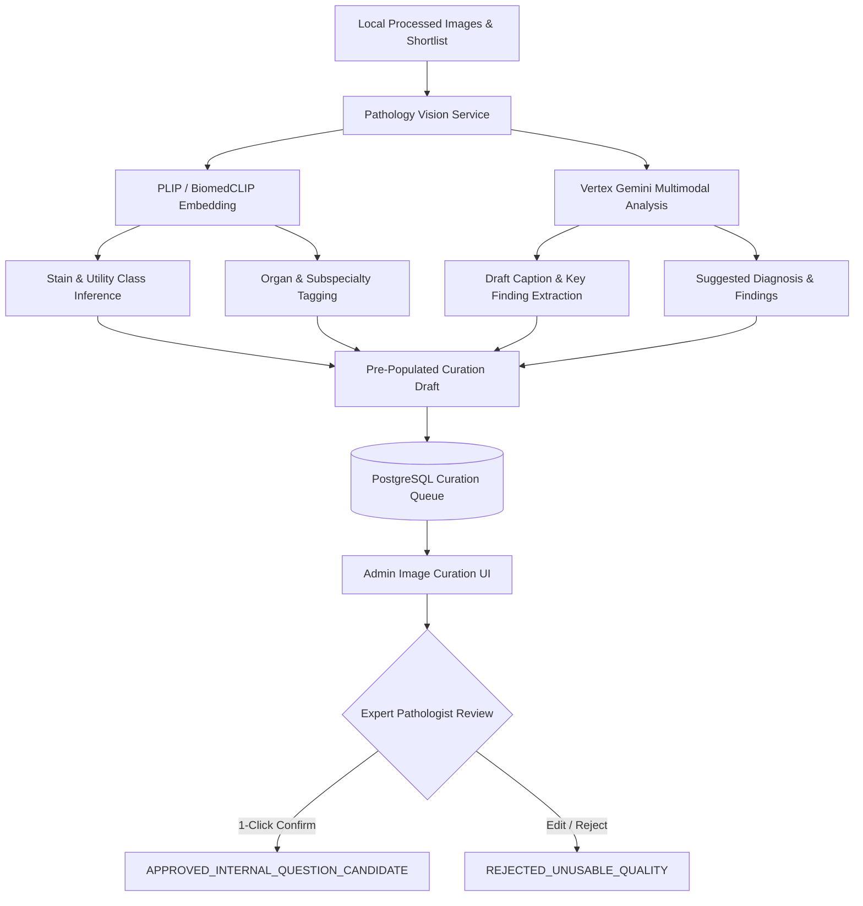

# Milestone 25 — AI-Assisted Pathology Vision Review & Multimodal Pre-Annotation Pipeline

> **Status**: PLANNED (DEFERRED FOR LATER EXECUTION)  
> **Pre-requisite**: Milestones 19C, 19D, 19E Part A (Shortlist & Local Image Proxy)

---

## 1. Executive Summary & Objective

Reviewing thousands of raw pathology microphotographs manually is time-consuming for expert pathologists and medical educators. **Milestone 25** implements an **AI-Assisted Pathology Vision Pipeline** that leverages open-source pathology foundation models (e.g., **PLIP**, **BiomedCLIP**, **CONCH**) alongside **Gemini 2.5 Flash / Pro Multimodal** to automate image pre-annotation, quality scoring, stain detection, and caption alignment.

This pipeline accelerates human review by 10x by pre-populating accurate drafts while strictly preserving the human-in-the-loop governance gate.

---

## 2. Target AI Pathology Vision Models

| Model | Source / Host | Primary Role in Pipeline | Output Signals |
|---|---|---|---|
| **PLIP** (*Pathology Language-Image Pretraining*) | Hugging Face (`vinid/plip`) | Pathology domain image-text matching & zero-shot classification | Image-caption alignment score, organ tissue type, morphology class |
| **BiomedCLIP** | Hugging Face (`microsoft/BiomedCLIP-PubMedBERT_256-vit_base_patch16_224`) | Biomedical image-text alignment | Broad biomedical concept probabilities, modality classification |
| **Gemini 2.5 Multimodal** | Vertex AI (`us-central1`) | Detailed microphotograph inspection & clinical rationale extraction | Stain identification, magnification estimate, differential diagnoses |
| **Local Quality Heuristics** | Python OpenCV / PIL | Geometric & entropy pre-filtering | Blank score, resolution audit, sharpness/blur metric |

---

## 3. Core Architecture & Workflow



---

## 4. Key Deliverables & Implementation Tasks

### Part 1: Pathology Vision ML Service (`backend/services/vision/`)
* **`plip_service.py`**:
  * Loads PLIP / BiomedCLIP model for zero-shot classification of pathology images against standardized vocabularies:
    * **Stains**: `H&E`, `PAS`, `Masson Trichrome`, `Giemsa`, `Ziehl-Neelsen`, `GMS`, `IHC (CK, CD3, CD20, Ki-67, HER2, ER/PR, Synaptophysin)`.
    * **Utility Classes**: `PATHOLOGY_MICROSCOPY`, `GROSS_PATHOLOGY`, `CYTOLOGY_OR_HEMATOLOGY`, `MEDICAL_DIAGRAM`, `TABLE_OR_TEXT_FIGURE`.
    * **Organ / Subspecialty**: Breast, Hematopathology, Gastrointestinal, Pulmonary, Renal, Gynecologic, Neuropathology.
* **`multimodal_annotator.py`**:
  * Combines visual image pixels with associated Robbins / Sternberg textbook page text to generate structured pre-annotation metadata:
    ```json
    {
      "suggested_utility_class": "PATHOLOGY_MICROSCOPY",
      "suggested_stain": "Hematoxylin and Eosin (H&E)",
      "suggested_magnification": "High power (400x)",
      "suggested_diagnosis": "Invasive Lobular Carcinoma of Breast",
      "suggested_caption": "Invasive lobular carcinoma exhibiting single-file dyscohesive cords of tumor cells with intracytoplasmic mucin vacuoles.",
      "confidence_score": 0.94,
      "alignment_with_page_text": "HIGH_CONFIDENCE_MATCH"
    }
    ```

### Part 2: Batch Pre-Annotation Runner (`scripts/preannotate_images.py`)
* Batch script to process the shortlisted or full image catalog:
  ```powershell
  python scripts/preannotate_images.py \
    --database-url-env REMOTE_DATABASE_URL \
    --image-dir data/processed/images \
    --model plip+gemini \
    --limit 72 \
    --apply
  ```
* Stores the AI pre-annotations under `ImageAsset.metadata_json["ai_preannotation"]` without altering authoritative verification status (`AI_SUGGESTED`).

### Part 3: UI Integration in Admin Image Curation (`apps/web/src/app/admin/image-curation/`)
* **1-Click Autofill**: Reviewers can click **"Apply AI Suggestions"** in the Image Curation panel to fill in Diagnosis, Stain, Magnification, and Caption instantly.
* **Visual Confidence Badges**: Displays confidence scores for detected stains and organ classes.
* **Fast-Track Sign-Off**: The human reviewer only needs to glance, verify the pre-filled medical facts, and click **"Approve for questions"**, reducing per-image review time from 3 minutes to under 15 seconds.

---

## 5. Governance & Safety Rules

1. **AI Suggestions are Never Ground Truth**:
   - `curation_status` remains `HUMAN_REVIEW` until an authenticated reviewer submits a decision.
   - All AI pre-annotations are tagged with `verification_status: AI_SUGGESTED`.
2. **Immutable Review History**:
   - Every human approval or modification creates an audit record in `image_reviews`.
3. **Claim Grounding**:
   - Diagnostic claims in the caption must be supported by both the visual findings and the referenced textbook chunk.
