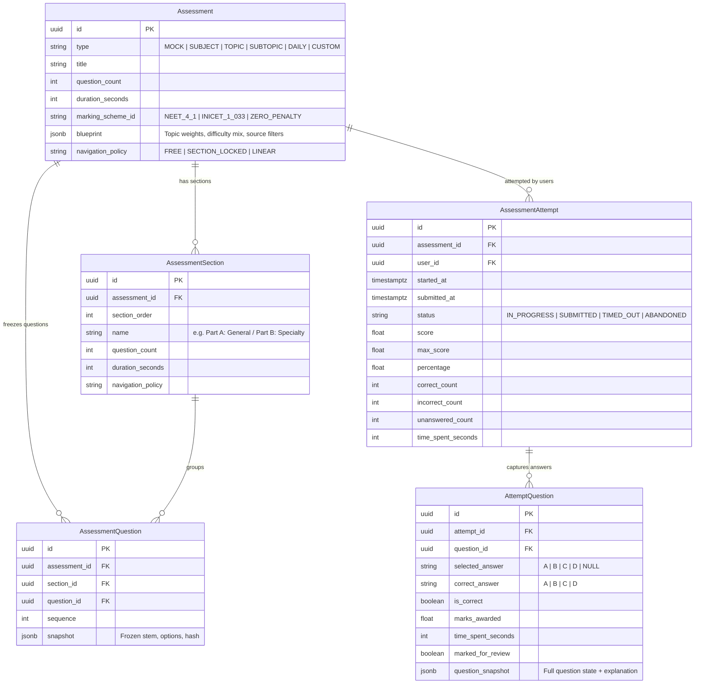

# Milestone 5 — Universal Assessment Engine & Modern Examination Platform

## 1. Core Architectural Principle: Universal Assessment Engine

> [!IMPORTANT]
> **Zero Hardcoded Exam Silos**: Do **not** create separate engine classes (e.g. `NEETUGExamEngine`, `NEETPGExamEngine`, `NEETSSExamEngine`).  
> Implement a single **Universal Assessment Engine** driven entirely by declarative blueprints, sections, navigation policies, and marking schemes.

```
                    UNIVERSAL ASSESSMENT ENGINE
                                │
        ┌───────────────────────┼───────────────────────┐
        ▼                       ▼                       ▼
   NEET-UG Mock            NEET-PG Mock            NEET-SS Mock
 ├── 180 Questions       ├── 200 Questions       ├── 150 Questions
 ├── +4 / -1 Marking     ├── +4 / -1 Marking     ├── +4 / -1 Marking
 ├── 200 Mins            ├── 210 Mins            ├── 150 Mins
 ├── Sections: Ph/Ch/Bio ├── Sections: Pre/Para  ├── Sections: Core/Allied
 └── Depth: UG           └── Depth: PG           └── Depth: SS
```

---

## 2. Assessment Data Model Specification

The assessment subsystem maps cleanly onto our canonical 3-tier medical knowledge taxonomy (`Course` $\rightarrow$ `Speciality` $\rightarrow$ `Subject` $\rightarrow$ `Topic` $\rightarrow$ `Subtopic` $\rightarrow$ `Learning Objective`):



---

## 3. Supported Assessment Presets & Granularities

| Assessment Type | Typical Q Count | Duration | Marking Scheme | Sections | Navigation Policy | Target Depth |
|---|---|---|---|---|---|---|
| **NEET-SS Grand Mock** | 150 Qs | 150 mins | $+4 / -1$ (600M) | Part A (Feeder) / Part B (Super-Specialty) | Free / Section-Locked | `super_specialty` |
| **NEET-PG Grand Mock** | 200 Qs | 210 mins | $+4 / -1$ (800M) | Clinical / Para-Clinical / Pre-Clinical | Free | `postgraduate` |
| **INI-CET Mock** | 200 Qs | 180 mins | $+1 / -0.33$ (200M) | Multi-Disciplinary Vignettes | Free | `postgraduate` |
| **Subject Mastery (SWT)** | 100 Qs | 100 mins | $+4 / -1$ | Single Section | Free | Configurable |
| **Topic Test (TLT)** | 50 Qs | 50 mins | $+4 / -1$ | Single Section | Free | Configurable |
| **Subtopic Micro-Quiz (SLT)** | 20 Qs | 20 mins | $+4 / -1$ | Single Section | Free | Configurable |
| **Daily Dose / Rapid Fire** | 10 Qs | 10 mins | $+4 / -1$ or $+1 / 0$ | Single Section | Free | High-Yield Mix |
| **Custom Practice (BYOT)** | 10 – 150 Qs | User Set | User Set | User Set | User Set | Multi-Select |

---

## 4. Marking Schemes & Scoring Formulas

$$\text{Final Score} = (\text{Correct Count} \times M_{\text{correct}}) - (\text{Incorrect Count} \times M_{\text{penalty}})$$

1. **`NEET_4_1`**: $M_{\text{correct}} = 4$, $M_{\text{penalty}} = 1$ ($25\%$ penalty).
2. **`INICET_1_033`**: $M_{\text{correct}} = 1$, $M_{\text{penalty}} = 0.3333$ ($33.3\%$ penalty).
3. **`PROPORTIONAL_1_025`**: $M_{\text{correct}} = 1$, $M_{\text{penalty}} = 0.25$ ($25\%$ penalty).
4. **`ZERO_PENALTY`** (Tutor / Learning Mode): $M_{\text{correct}} = 1$, $M_{\text{penalty}} = 0$.

### Core Metrics Captured:
* **Raw Marks & Max Marks**: e.g., $442 / 600\text{ Marks}$.
* **Accuracy Percentage**: $\frac{\text{Correct}}{\text{Attempted}} \times 100$.
* **Attempt Rate**: $\frac{\text{Attempted}}{\text{Total Questions}} \times 100$.
* **Negative Marks Lost**: Exact score deducted due to wrong attempts.
* **Speed Velocity**: Average seconds spent per question.

---

## 5. UI Architecture (`ixartz/SaaS-Boilerplate` + Shadcn UI)

Built on Next.js 14/15 App Router, Tailwind CSS, Radix UI primitives, Lucide icons, and full dark/light theme support:

```
frontend/
├── app/
│   ├── (dashboard)/
│   │   ├── exams/
│   │   │   ├── page.tsx            # Exam hub: Presets, Active tests, History
│   │   │   ├── new/page.tsx        # Universal Blueprint Generator (BYOT)
│   │   │   └── [id]/
│   │   │       ├── results/page.tsx # Diagnostic Scorecard & Analytics
│   │   │       └── review/page.tsx  # Deep Question Review with Evidence
│   └── (exam-runner)/
│       └── exams/[id]/take/page.tsx # Distraction-Free Fullscreen Runner
│
├── components/
│   ├── exam/
│   │   ├── question-canvas.tsx      # Medical stem + rich option cards + strike-through
│   │   ├── question-palette.tsx     # Prometric 5-state question grid
│   │   ├── countdown-timer.tsx      # Auto-pulsing sticky timer
│   │   ├── section-tabs.tsx         # Multi-section switcher
│   │   └── scorecard-hero.tsx       # Marks hero card + accuracy rings
│   └── ui/                          # Button, Dialog, Combobox, Slider, Tabs
```

### 5.1 Prometric / NBE Standard Question Palette
* ⚪ **Not Visited** (`text-slate-400 border-slate-700`)
* 🔴 **Not Answered** (`bg-rose-500/20 text-rose-400 border-rose-500`)
* 🟢 **Answered** (`bg-emerald-500/20 text-emerald-400 border-emerald-500`)
* 🟣 **Marked for Review** (`bg-purple-500/20 text-purple-400 border-purple-500`)
* 🟣🟢 **Answered & Marked** (`bg-purple-500/20 border-purple-500 with emerald badge`).

### 5.2 Offline & Interruption Resilience
* **Zero Latency Local Sync**: Immediate `localStorage` answer caching.
* **Background Heartbeat**: `PATCH /api/assessments/attempts/{id}/heartbeat` every 20 seconds.
* **Session Resume**: Seamlessly recovers interrupted sessions with verified remaining time.

---

## 6. PostgreSQL Schema DDL

```sql
-- 1. Marking Schemes
CREATE TABLE IF NOT EXISTS marking_schemes (
    id VARCHAR(50) PRIMARY KEY,
    name VARCHAR(100) NOT NULL,
    correct_marks FLOAT NOT NULL DEFAULT 4.0,
    penalty_marks FLOAT NOT NULL DEFAULT 1.0,
    unanswered_marks FLOAT NOT NULL DEFAULT 0.0
);

INSERT INTO marking_schemes (id, name, correct_marks, penalty_marks, unanswered_marks) VALUES
('NEET_4_1', 'NEET Standard (+4, -1)', 4.0, 1.0, 0.0),
('INICET_1_033', 'INI-CET Standard (+1, -0.333)', 1.0, 0.3333, 0.0),
('PROPORTIONAL_1_025', 'Proportional (+1, -0.25)', 1.0, 0.25, 0.0),
('ZERO_PENALTY', 'Learning Mode (+1, 0)', 1.0, 0.0, 0.0)
ON CONFLICT (id) DO NOTHING;

-- 2. Assessments Table
CREATE TABLE IF NOT EXISTS assessments (
    id UUID PRIMARY KEY DEFAULT gen_random_uuid(),
    type VARCHAR(50) NOT NULL, -- 'MOCK', 'SUBJECT', 'TOPIC', 'SUBTOPIC', 'DAILY', 'CUSTOM'
    title VARCHAR(255) NOT NULL,
    question_count INT NOT NULL,
    duration_seconds INT NOT NULL,
    marking_scheme_id VARCHAR(50) NOT NULL REFERENCES marking_schemes(id),
    navigation_policy VARCHAR(50) NOT NULL DEFAULT 'FREE', -- 'FREE', 'SECTION_LOCKED', 'LINEAR'
    blueprint JSONB NOT NULL DEFAULT '{}'::jsonb,
    created_at TIMESTAMPTZ NOT NULL DEFAULT NOW()
);

-- 3. Assessment Sections (Supports Part A / Part B / Timed Sections)
CREATE TABLE IF NOT EXISTS assessment_sections (
    id UUID PRIMARY KEY DEFAULT gen_random_uuid(),
    assessment_id UUID NOT NULL REFERENCES assessments(id) ON DELETE CASCADE,
    section_order INT NOT NULL DEFAULT 1,
    name VARCHAR(150) NOT NULL,
    question_count INT NOT NULL,
    duration_seconds INT,
    navigation_policy VARCHAR(50) DEFAULT 'FREE',
    CONSTRAINT uq_assessment_section_order UNIQUE (assessment_id, section_order)
);

-- 4. Assessment Questions (Immutable Question Snapshot)
CREATE TABLE IF NOT EXISTS assessment_questions (
    id UUID PRIMARY KEY DEFAULT gen_random_uuid(),
    assessment_id UUID NOT NULL REFERENCES assessments(id) ON DELETE CASCADE,
    section_id UUID REFERENCES assessment_sections(id) ON DELETE SET NULL,
    question_id UUID NOT NULL REFERENCES questions(id) ON DELETE RESTRICT,
    sequence INT NOT NULL,
    snapshot JSONB NOT NULL, -- Stores frozen stem, options, content_hash
    CONSTRAINT uq_assessment_question_seq UNIQUE (assessment_id, sequence)
);

-- 5. Assessment Attempts (User Attempt Sessions)
CREATE TABLE IF NOT EXISTS assessment_attempts (
    id UUID PRIMARY KEY DEFAULT gen_random_uuid(),
    assessment_id UUID NOT NULL REFERENCES assessments(id) ON DELETE CASCADE,
    user_id UUID REFERENCES users(id) ON DELETE SET NULL,
    started_at TIMESTAMPTZ NOT NULL DEFAULT NOW(),
    submitted_at TIMESTAMPTZ,
    status VARCHAR(50) NOT NULL DEFAULT 'IN_PROGRESS', -- 'IN_PROGRESS', 'SUBMITTED', 'TIMED_OUT', 'ABANDONED'
    score FLOAT DEFAULT 0.0,
    max_score FLOAT DEFAULT 0.0,
    percentage FLOAT DEFAULT 0.0,
    correct_count INT DEFAULT 0,
    incorrect_count INT DEFAULT 0,
    unanswered_count INT DEFAULT 0,
    time_spent_seconds INT DEFAULT 0
);

-- 6. Attempt Questions (Detailed Question-Level Responses)
CREATE TABLE IF NOT EXISTS attempt_questions (
    id UUID PRIMARY KEY DEFAULT gen_random_uuid(),
    attempt_id UUID NOT NULL REFERENCES assessment_attempts(id) ON DELETE CASCADE,
    question_id UUID NOT NULL REFERENCES questions(id) ON DELETE RESTRICT,
    selected_answer CHAR(1),
    correct_answer CHAR(1) NOT NULL,
    is_correct BOOLEAN,
    marks_awarded FLOAT DEFAULT 0.0,
    time_spent_seconds INT DEFAULT 0,
    marked_for_review BOOLEAN DEFAULT FALSE,
    question_snapshot JSONB NOT NULL,
    CONSTRAINT uq_attempt_question UNIQUE (attempt_id, question_id)
);

CREATE INDEX IF NOT EXISTS idx_assessment_attempts_user ON assessment_attempts(user_id);
CREATE INDEX IF NOT EXISTS idx_assessment_questions_assessment ON assessment_questions(assessment_id);
CREATE INDEX IF NOT EXISTS idx_attempt_questions_attempt ON attempt_questions(attempt_id);
```

---

## 7. API Endpoints Specification

| Method | Endpoint | Description |
|---|---|---|
| `GET` | `/api/assessments/presets` | List standard 1-click presets (NEET-SS, NEET-PG, Daily Dose, etc.). |
| `POST` | `/api/assessments` | Generates a new assessment from blueprint & freezes question snapshots. |
| `POST` | `/api/assessments/{id}/start` | Initiates user attempt, starts timer, returns sanitized question payload. |
| `GET` | `/api/assessments/attempts/{id}` | Fetches active attempt state (stripping answers and explanations). |
| `PATCH` | `/api/assessments/attempts/{id}/heartbeat` | Background sync: persists answers, review marks, elapsed time. |
| `POST` | `/api/assessments/attempts/{id}/submit` | Calculates score, marks, accuracy, analytics, and locks attempt. |
| `GET` | `/api/assessments/attempts/{id}/results` | Returns diagnostic scorecard, marks summary, topic velocity metrics. |
| `GET` | `/api/assessments/attempts/{id}/review` | Returns deep review canvas with ground truth, explanations, and evidence. |

---

## 8. Phased Implementation Roadmap

* **Stage 5A (Core Functional Engine)**: Blueprint generator, single/multi-section runner, Prometric palette, heartbeat auto-save, $+4/-1$ & $+1/-0.33$ scoring, and review canvas.
* **Stage 5B (Medical Aspirant Polish)**: Option strike-through tool, tutor/practice pause rules, font size zoom (`A+/A-`), and 1-click weak subtopic remediation test button.
