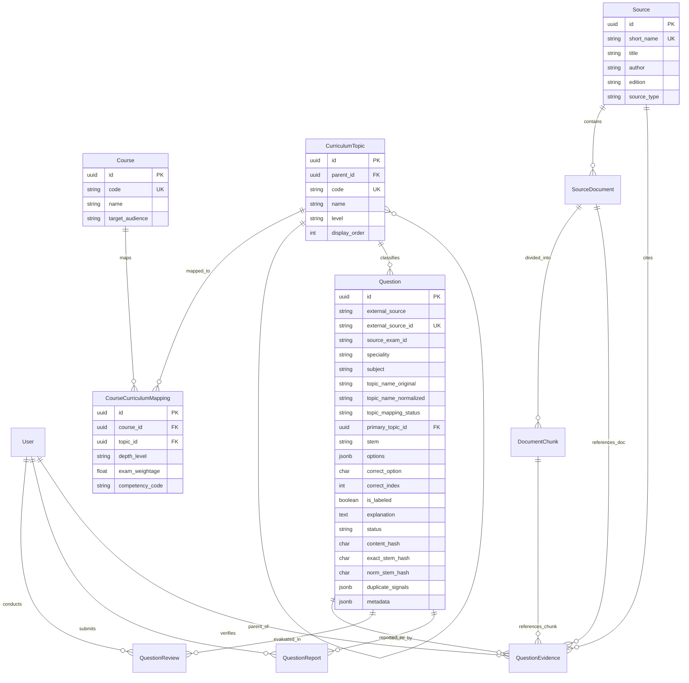

# Milestone 2 — PostgreSQL Persistence, SQLAlchemy Models & Universal Ingestion Engine

## 1. Objective & Executive Summary

The objective of Milestone 2 is to establish the production-grade, ACID-compliant **relational persistence layer** for the DocEdge Medical Exam Platform, implement SQLAlchemy ORM models matching our domain architecture, configure containerized database infrastructure, seed foundational medical knowledge sources and academic curricula, and build a high-performance **Universal Ingestion Engine** capable of importing questions from diverse intake channels into PostgreSQL.

> [!IMPORTANT]
> **Persistence Principle**: PostgreSQL 16 serves as the single canonical source of truth for the platform. Database operations must strictly enforce schema constraints, enum validations, deterministic primary keys, and transactional integrity.

---

## 2. Relational Database Architecture & ERD

The database schema models users, educational courses, the canonical medical taxonomy, authoritative reference works, and multi-source questions with comprehensive review and reporting workflows:



---

## 3. Database Schema Specification (`database/schema.sql`)

The schema is formalized in [`database/schema.sql`](file:///r:/Repositories/medical-learning-intelligence/database/schema.sql) and SQLAlchemy models in [`database/models.py`](file:///r:/Repositories/medical-learning-intelligence/database/models.py).

### 3.1 Type-Safe Database Enums

```sql
-- User Roles & Access Control
CREATE TYPE user_role AS ENUM ('SUPER_ADMIN', 'ADMIN', 'REVIEWER', 'EDUCATOR', 'STUDENT', 'USER');

-- Taxonomy & Curriculum Levels
CREATE TYPE curriculum_level AS ENUM ('SPECIALITY', 'SUBJECT', 'TOPIC', 'SUBTOPIC', 'LEARNING_OBJECTIVE');
CREATE TYPE depth_level AS ENUM ('UNDERGRADUATE', 'POSTGRADUATE', 'SUPER_SPECIALTY', 'GENERAL');
CREATE TYPE topic_mapping_status AS ENUM ('UNMAPPED', 'RAW_ONLY', 'MAPPED');

-- Source & Reference Types
CREATE TYPE source_type AS ENUM ('TEXTBOOK', 'WHO_CLASSIFICATION', 'GUIDELINE', 'JOURNAL_ARTICLE');
CREATE TYPE verification_status AS ENUM ('AI_SUGGESTED', 'HUMAN_VERIFIED', 'REJECTED');

-- Question Attributes & Lifecycle States
CREATE TYPE question_type AS ENUM ('SINGLE_BEST_ANSWER', 'MULTIPLE_CHOICE', 'ASSERTION_REASON', 'MATCH_MATRIX', 'CASE_BASED');
CREATE TYPE question_status AS ENUM ('IMPORTED', 'GENERATED', 'AI_REVIEW', 'HUMAN_REVIEW', 'APPROVED', 'REJECTED', 'REPORTED', 'RETIRED');
CREATE TYPE difficulty_level AS ENUM ('EASY', 'MEDIUM', 'HARD', 'EXPERT');
CREATE TYPE cognitive_level AS ENUM ('RECALL', 'UNDERSTANDING', 'APPLICATION', 'ANALYSIS');

-- Feedback & Report Categorization
CREATE TYPE report_category AS ENUM ('INCORRECT_ANSWER', 'INCORRECT_EXPLANATION', 'AMBIGUOUS_QUESTION', 'MULTIPLE_CORRECT_ANSWERS', 'POOR_WORDING', 'WRONG_TOPIC', 'WRONG_DIFFICULTY', 'OUTDATED_INFO', 'SOURCE_REFERENCE_PROBLEM', 'OTHER');
CREATE TYPE report_status AS ENUM ('SUBMITTED', 'UNDER_REVIEW', 'RESOLVED', 'REJECTED');
CREATE TYPE reviewer_type AS ENUM ('AI', 'HUMAN', 'EDITORIAL');
```

### 3.2 Key Relational Tables

1. **`questions` Table**:
   - `id UUID PRIMARY KEY`: Deterministic UUID generated via UUIDv5.
   - `external_source VARCHAR(50)`: Intake source (`'medmcqa'`, `'csv_import'`, `'google_forms'`, `'manual_admin'`, `'ai_generator'`).
   - `external_source_id VARCHAR(100) UNIQUE NOT NULL`: Unique external key (e.g. `medmcqa-af913acc-...`).
   - `source_exam_id VARCHAR(100)`: Historical paper tag (e.g. `'NEET-PG-2021'`, `'AIIMS-MAY-2018'`).
   - `primary_topic_id UUID REFERENCES curriculum_topics(id)`: Canonical medical taxonomy classification.
   - `options JSONB NOT NULL`: Structured option payload `[{"key": "A", "text": "..."}, ...]`.
   - `content_hash CHAR(64) NOT NULL`: Cryptographic SHA-256 hash for deduplication.
   - Indexes: `idx_questions_content_hash`, `idx_questions_topic`, `idx_questions_status`, `idx_questions_source_exam`.

2. **`curriculum_topics` Table**:
   - Self-referencing tree representing exam-agnostic medical science taxonomy.
   - Hierarchy: `SPECIALITY` $\rightarrow$ `SUBJECT` $\rightarrow$ `TOPIC` $\rightarrow$ `SUBTOPIC` $\rightarrow$ `LEARNING_OBJECTIVE`.

3. **`course_curriculum_mappings` Table**:
   - Many-to-many relationship linking `courses` and `curriculum_topics`.
   - Captures `depth_level` (`UNDERGRADUATE`, `POSTGRADUATE`, `SUPER_SPECIALTY`), target `exam_weightage` (0.0 to 1.0), and official `competency_code` (e.g., NMC CBME `PE9.1`).

4. **`sources`, `source_documents`, `document_chunks` & `question_evidence` Tables**:
   - Hierarchical citation model storing authoritative reference works down to chunk-level quotes.
   - Enforces verification auditability (`verification_status`, `confidence`, `verified_by`).

---

## 4. Containerized Database Infrastructure

Database infrastructure is managed via Docker Compose in [`infrastructure/docker-compose.yml`](file:///r:/Repositories/medical-learning-intelligence/infrastructure/docker-compose.yml):

```yaml
version: '3.8'

services:
  postgres:
    image: pgvector/pgvector:pg16
    container_name: medical_exam_postgres
    restart: unless-stopped
    environment:
      POSTGRES_DB: medical_exam_ai
      POSTGRES_USER: postgres
      POSTGRES_PASSWORD: postgrespassword
    ports:
      - "5432:5432"
    volumes:
      - postgres_data:/var/lib/postgresql/data
    healthcheck:
      test: ["CMD-SHELL", "pg_isready -U postgres -d medical_exam_ai"]
      interval: 10s
      timeout: 5s
      retries: 5

volumes:
  postgres_data:
```

---

## 5. Foundational Curriculum & Knowledge Seeding

The script [`scripts/seed_curriculum.py`](file:///r:/Repositories/medical-learning-intelligence/scripts/seed_curriculum.py) initializes foundational data:

### 5.1 Authoritative Medical Sources Seeded
1. **Robbins, Cotran & Kumar Pathologic Basis of Disease** (11th Edition, 2025, Elsevier)
2. **WHO Classification of Tumours / Blue Books** (5th Edition, 2022, IARC Press)
3. **Sternberg's Diagnostic Surgical Pathology** (7th Edition, 2021, Wolters Kluwer)
4. **Rosai and Ackerman's Surgical Pathology** (11th Edition, 2017, Elsevier)
5. **Diagnostic Immunohistochemistry: Theranostic and Genomic Applications** (Dabbs, 6th Edition, 2021, Elsevier)
6. **Koss' Diagnostic Cytology and Its Histopathologic Bases** (5th Edition, 2005, LWW)

### 5.2 Academic Courses Seeded
- **`DM-ONCOPATH`**: DM / DrNB Oncopathology (Super-Specialty)
- **`MD-PATH`**: MD / DNB Pathology (Postgraduate)
- **`NEET-PG`**: NEET-PG / INI-CET Medical Entrance (Postgraduate Entrance)
- **`MBBS-PATH`**: MBBS 2nd Professional Pathology (Undergraduate)

### 5.3 Initial Canonical Topic Hierarchy Seeded
- **Speciality**: Pathology (`SPEC-PATH`)
- **Subject**: General Pathology (`SUBJ-GEN-PATH`), Systemic Pathology (`SUBJ-SYS-PATH`), Hematopathology (`SUBJ-HEM-PATH`), Molecular Pathology (`SUBJ-MOL-PATH`)
- **Topics**: Cell Injury & Adaptation, Inflammation & Repair, Neoplasia, Hemodynamic Disorders, Breast Pathology, Gastrointestinal Pathology, etc.

---

## 6. Universal Multi-Source Ingestion Engine

To ingest questions from multiple intake channels with 100% schema conformity, [`backend/ingestion/universal_ingestor.py`](file:///r:/Repositories/medical-learning-intelligence/backend/ingestion/universal_ingestor.py) and [`scripts/ingest_cli.py`](file:///r:/Repositories/medical-learning-intelligence/scripts/ingest_cli.py) were created.

### 6.1 Supported Intake Channels

```
                               UNIVERSAL INGESTION ENGINE
                                           │
         ┌───────────────────┬─────────────┴─────┬───────────────────┐
         ▼                   ▼                   ▼                   ▼
   MedMCQA JSONL         CSV Files          Google Forms       Direct Admin
 (Processed splits)  (Spreadsheet dumps)   (Webhook/JSON)      (Manual/JSON)
         │                   │                   │                   │
         └───────────────────┼───────────────────┴───────────────────┘
                             │
                             ▼
                  VALIDATION & SANITIZATION
         ├── Medical Unicode Sanitization (NFKC normalization)
         ├── Options Array Parsing (4 options standardized)
         ├── Answer Resolution (Key 0-3, 1-4, or A-D -> Char 'A'-'D')
         ├── Deterministic UUIDv5 Generation
         ├── Cryptographic SHA-256 Hashing (Stem + Options)
         └── Duplicate & Collision Analysis
                             │
                             ▼
                 TRANSACTIONAL BATCH INSERT
                  (PostgreSQL 16 via SQLAlchemy)
```

### 6.2 Universal Ingestion CLI Commands

```bash
# Ingest processed Pathology JSONL questions
python scripts/ingest_cli.py jsonl --file data/processed/pathology/pathology_all.jsonl --batch-size 1000

# Ingest CSV question spreadsheet
python scripts/ingest_cli.py csv --file path/to/questions.csv --external-source "faculty_submission"

# Ingest Google Forms JSON submission dump
python scripts/ingest_cli.py forms --file path/to/forms_responses.json

# Ingest single question payload via JSON string
python scripts/ingest_cli.py manual --json '{"stem": "What is...", "options": ["A", "B", "C", "D"], "correct_option": "A"}'
```

---

## 7. Database Import Execution & Ingestion Results

The dedicated batch importer [`scripts/import_to_db.py`](file:///r:/Repositories/medical-learning-intelligence/scripts/import_to_db.py) performs high-throughput chunked insertion:

```bash
# Start PostgreSQL via Docker Compose
docker compose -f infrastructure/docker-compose.yml up -d

# Seed schema, foundational sources, curriculum, and import all 15,526 Pathology questions
python scripts/import_to_db.py --input data/processed/pathology/pathology_all.jsonl --batch-size 1000
```

### Ingestion Metrics:
- **Total Processed Records**: 15,526
- **Total Inserted Questions**: 15,526
- **Database Table Verification**: 100% records persisted with populated JSONB options, content hashes, and status tags.

---

## 8. Verification & Test Suite Execution

The persistence layer and universal ingestion engine are verified through automated unit and integration tests:

```bash
# Run database schema and model relationship test suite
python -m unittest tests/test_database.py

# Run universal ingestion multi-source test suite
python -m unittest tests/test_universal_ingestion.py
```

### Test Coverage Summary:
- [x] **Schema Creation & Table Verification**: Validates all 11 core relational tables, foreign key constraints, and indexes.
- [x] **Foundational Curriculum Seeding**: Validates insertion of 6 reference sources, 4 courses, and cross-course topic depth mappings.
- [x] **Evidence & Document Linkage**: Tests end-to-end foreign key relationships from `questions` $\rightarrow$ `question_evidence` $\rightarrow$ `sources` / `source_documents` / `document_chunks`.
- [x] **JSONL Batch Ingestion & Idempotency**: Verifies batch inserting with duplicate skip handling.
- [x] **Multi-Source Ingestion**: Tests ingestion of CSV, Google Forms, Manual JSON, and AI candidate formats with deterministic UUID generation and Unicode sanitization.

---

## 9. Milestone Deliverables Summary

1. **Database Schema & ORM Models**: Complete SQLAlchemy entity definitions in `database/models.py` and SQL DDL in `database/schema.sql`.
2. **Containerized Infrastructure**: Docker Compose configuration running PostgreSQL 16 with pgvector support.
3. **Curriculum & Source Seeding**: Executable seed script populating foundational medical reference sources, courses, and taxonomy.
4. **Universal Ingestion System**: Multi-channel intake engine in `backend/ingestion/universal_ingestor.py` and CLI tools.
5. **Populated Question Bank**: 15,526 Pathology questions successfully imported into PostgreSQL.
6. **Automated Test Suites**: 100% green tests in `tests/test_database.py` and `tests/test_universal_ingestion.py`.
