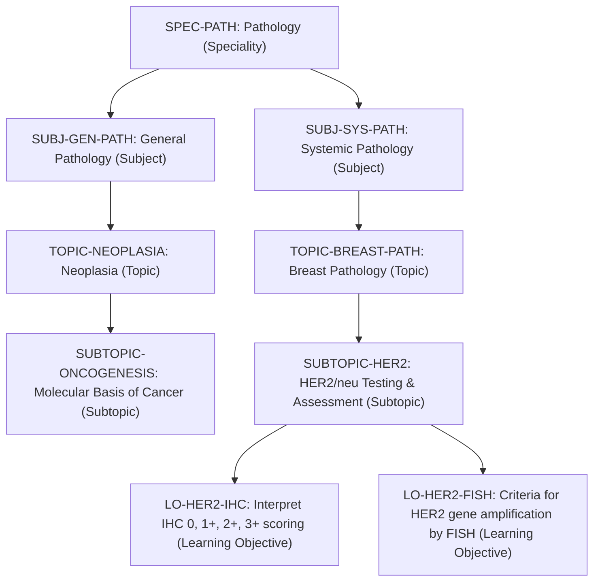
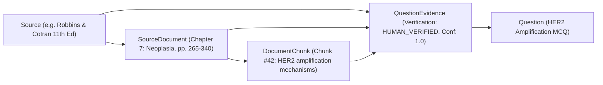

# Milestone 3 — Three-Tier Domain Decoupling & Authoritative Evidence Citation Model

## 1. Objective & Executive Summary

The objective of Milestone 3 is to establish and enforce the **Three-Tier Domain Decoupling Architecture** across the platform and implement a hierarchical **Authoritative Reference & Evidence Citation Subsystem**.

This architectural milestone resolves the common antipattern in medical software where medical questions, academic degrees, and exam syllabi are tightly coupled. Instead, it strictly decouples:
1. **Medical Knowledge Science** (Pure medical taxonomy: Speciality $\rightarrow$ Subject $\rightarrow$ Topic $\rightarrow$ Subtopic $\rightarrow$ Learning Objective).
2. **Educational Programs & Curricula** (Academic degrees and entrance frameworks: MBBS, MD, DM, NEET-PG, NEET-SS).
3. **Question Provenance & Source Exams** (Historical origins: past papers, faculty submissions, dataset IDs).

In addition, it establishes the **4-tier authoritative citation model** connecting questions to peer-reviewed textbooks (*Robbins*, *WHO Blue Books*, *Sternberg*, *Ackerman*, *Dabbs*, *Koss*) down to exact chapters, pages, and extracted text chunks with cryptographic provenance.

> [!IMPORTANT]
> **Medical Verification Invariant**: AI-inferred textbook citations are **never** represented as verified references. The system strictly records `verification_status` (`AI_SUGGESTED`, `HUMAN_VERIFIED`, `REJECTED`), confidence scores, and verifier user provenance.

---

## 2. The Three-Tier Domain Architecture

```
                                  TIER 1: MEDICAL KNOWLEDGE TAXONOMY
                                         (CurriculumTopic Tree)
                   Speciality ──► Subject ──► Topic ──► Subtopic ──► Learning Objective
                                                   │
                         ┌─────────────────────────┴─────────────────────────┐
                         │                                                   │
                         ▼                                                   ▼
            TIER 2: COURSE CURRICULA                            TIER 3: QUESTION PROVENANCE
        (Course & CourseCurriculumMapping)                     (Question & SourceExam Metadata)
   ┌──────────────────────────────────────────┐            ┌──────────────────────────────────────────┐
   │ MBBS Pathology:                          │            │ Question: "HER2 3+ IHC score is:"        │
   │  - Depth: UNDERGRADUATE                  │            │  - external_source: "medmcqa"            │
   │  - Weightage: 5% | Code: CBME-PE9.1      │            │  - external_source_id: "medmcqa-af91..." │
   │                                          │            │  - source_exam_id: "AIIMS-MAY-2018"      │
   │ MD Pathology:                            │            │  - primary_topic_id: TOPIC-BREAST-PATH   │
   │  - Depth: POSTGRADUATE                   │            │                                          │
   │  - Weightage: 15% | Code: MD-BR-01       │            │  * Question belongs to medical science,  │
   │                                          │            │    NOT locked to AIIMS or NEET syllabus  │
   │ DM Oncopathology:                        │            └──────────────────────────────────────────┘
   │  - Depth: SUPER_SPECIALTY                │
   │  - Weightage: 25% | Code: DM-BR-03       │
   └──────────────────────────────────────────┘
```

---

## 3. Deep Dive: The Three Tiers

### 3.1 Tier 1: Canonical Medical Knowledge Taxonomy (`CurriculumTopic`)

Represents pure, exam-agnostic medical science concepts. Every question in the platform maps to exactly one canonical node in the taxonomy via `primary_topic_id`.

$$\text{Speciality} \longrightarrow \text{Subject} \longrightarrow \text{Topic} \longrightarrow \text{Subtopic} \longrightarrow \text{Learning Objective}$$



### 3.2 Tier 2: Educational Programs & Curricula (`Course` & `CourseCurriculumMapping`)

Academic courses represent degrees, entrance exams, or training certifications:
- **`MBBS-PATH`**: Undergraduate medical curriculum (NMC CBME guidelines).
- **`MD-PATH`**: Postgraduate residency in Pathology.
- **`DM-ONCOPATH`**: Super-specialty fellowship in Oncopathology.
- **`NEET-PG` / `INI-CET`**: Postgraduate entrance examinations.
- **`NEET-SS`**: Super-specialty entrance examinations.

#### Cross-Course Topic Sharing
A single canonical topic (e.g. `TOPIC-BREAST-PATH`) is mapped to multiple courses with distinct depth expectations, exam weightages, and competency codes:

| Course Code | Target Depth (`depth_level`) | Exam Weightage | Competency Code | Core / Elective |
|---|---|---|---|---|
| `MBBS-PATH` | `UNDERGRADUATE` | 5% (`0.05`) | `PE9.1` (NMC CBME) | Core |
| `MD-PATH` | `POSTGRADUATE` | 15% (`0.15`) | `MD-PATH-BREAST-01` | Core |
| `DM-ONCOPATH`| `SUPER_SPECIALTY` | 25% (`0.25`) | `DM-ONCO-BR-HER2` | Core |
| `NEET-PG` | `POSTGRADUATE` | 8% (`0.08`) | `NEET-PG-SYS-PATH` | Core |

> [!TIP]
> **Dynamic Reusability**: When an educator adds a question on HER2 IHC scoring, the question is classified under the canonical topic `TOPIC-BREAST-PATH`. It automatically becomes eligible for MBBS, MD, and DM mock exams according to the course's configured depth level and difficulty filters without duplication.

### 3.3 Tier 3: Question Provenance & Historical Exam Origins

Questions preserve historical provenance without polluting curriculum definitions:
- `external_source`: Origin channel (`'medmcqa'`, `'faculty_submission'`, `'manual_admin'`, `'ai_generator'`).
- `external_source_id`: Unique identifier from the originating source (e.g. `medmcqa-b19df...`).
- `source_exam_id`: Historical exam sitting code (e.g. `'NEET-PG-2021'`, `'AIIMS-MAY-2018'`, `'PGI-JUNE-2019'`).

**Decoupling Invariant**: A question with `source_exam_id = 'NEET-PG-2021'` is **not** permanently hardcoded to NEET-PG. If its subject matter tests basic inflammation, it can be served to an MBBS undergraduate student as a practice question.

---

## 4. Authoritative Evidence & Textbook Citation Model

The platform defines a 4-tier evidence model connecting questions to authoritative literature down to exact extracted chunks:



### 4.1 Citation Entity Specifications

1. **`Source`**:
   - `short_name`: Machine identifier (`robbins_pathology`, `who_blue_books`, `sternberg_surgical_pathology`).
   - `title`, `author`, `edition`, `year`, `publisher`, `source_type` (`TEXTBOOK`, `WHO_CLASSIFICATION`, `GUIDELINE`, `JOURNAL_ARTICLE`).
2. **`SourceDocument`**:
   - `source_id`: Foreign key $\rightarrow$ `sources.id`.
   - `title`, `edition`, `volume`, `chapter_number`, `page_start`, `page_end`, `file_path`, `file_hash`.
3. **`DocumentChunk`**:
   - `document_id`: Foreign key $\rightarrow$ `source_documents.id`.
   - `chunk_index`, `section_heading`, `page_number`, `content`, `content_hash`.
   - Ready for vector embeddings (`pgvector` cosine similarity retrieval).
4. **`QuestionEvidence`**:
   - `question_id`: Foreign key $\rightarrow$ `questions.id`.
   - `source_id`: Foreign key $\rightarrow$ `sources.id`.
   - `document_id`, `chunk_id`: Optional foreign keys.
   - `volume`, `chapter`, `section`, `page_range`: Granular human-readable citations (e.g. `'Chapter 7, Section: Oncogenes', 'pp. 282-285'`).
   - `excerpt`: Exact authoritative quote verifying the answer.
   - `verification_status`: `AI_SUGGESTED` | `HUMAN_VERIFIED` | `REJECTED`.
   - `confidence`: Confidence score (0.0 to 1.0).
   - `verified_by`: User ID of approving medical faculty.

---

## 5. Question Review & Feedback Subsystems

To maintain quality and continuous curation, two specialized feedback models are established:

### 5.1 `QuestionReview` (Editorial & Faculty Curation)
Tracks peer review and AI evaluation before questions are approved for live exams:
- `question_id`: Foreign key $\rightarrow$ `questions.id`.
- `reviewer_id`: User ID of reviewer.
- `reviewer_type`: `AI` | `HUMAN` | `EDITORIAL`.
- `review_status`: `APPROVED` | `REJECTED` | `CHANGES_REQUESTED`.
- `score`: Composite quality score (0.0 to 1.0).
- `comments`, `suggested_edits` (JSONB).

### 5.2 `QuestionReport` (Student Issue Reporting)
Allows learners to flag problematic questions directly from the exam runner:
- `question_id`: Foreign key $\rightarrow$ `questions.id`.
- `user_id`: Reporting user.
- `category`: 
  - `INCORRECT_ANSWER`: Disputed answer key.
  - `INCORRECT_EXPLANATION`: Factual error in explanation.
  - `AMBIGUOUS_QUESTION`: Multiple interpretations possible.
  - `MULTIPLE_CORRECT_ANSWERS`: More than one correct choice.
  - `POOR_WORDING`: Grammatical or clarity issue.
  - `WRONG_TOPIC`: Mismatched topic classification.
  - `WRONG_DIFFICULTY`: Assigned difficulty inaccurate.
  - `OUTDATED_INFO`: Superseded by newer medical guidelines (e.g. WHO classification update).
  - `SOURCE_REFERENCE_PROBLEM`: Incorrect textbook citation.
  - `OTHER`: Freeform feedback.
- `description`: Detailed learner explanation.
- `status`: `SUBMITTED` $\rightarrow$ `UNDER_REVIEW` $\rightarrow$ `RESOLVED` $\rightarrow$ `REJECTED`.
- `admin_notes`, `resolved_by`, `resolved_at`.

---

## 6. Verification & Automated Test Suite

Milestone 3's domain decoupling and evidence relationships are validated in [`tests/test_database.py`](file:///r:/Repositories/medical-learning-intelligence/tests/test_database.py):

```bash
python -m unittest tests/test_database.py
```

### Verification Checklist:
- [x] **Canonical Topic Hierarchy**: Confirms recursive parent-child linkages from Speciality (`SPEC-PATH`) to Subject (`SUBJ-GEN-PATH`) to Topic (`TOPIC-BREAST-PATH`).
- [x] **Cross-Course Topic Mapping**: Confirms `TOPIC-BREAST-PATH` maps to 4 separate courses with distinct `depth_level` (`SUPER_SPECIALTY` for DM vs `UNDERGRADUATE` for MBBS).
- [x] **Authoritative Evidence Linkage**: Tests creation and foreign key resolution across `Source` $\rightarrow$ `SourceDocument` $\rightarrow$ `DocumentChunk` $\rightarrow$ `QuestionEvidence` $\rightarrow$ `Question`.
- [x] **Provenance Integrity**: Verifies question storage maintains historical provenance tags (`source_exam_id`, `external_source`) without violating relational constraints.
- [x] **Verification State Invariant**: Asserts that `QuestionEvidence` records properly isolate `AI_SUGGESTED` from `HUMAN_VERIFIED` states.

---

## 7. Milestone Deliverables Summary

1. **Three-Tier Architecture**: Documented and implemented domain separation across taxonomy, curricula, and provenance.
2. **Authoritative Evidence System**: Complete 4-tier reference schema supporting granular book citations, excerpts, and verification audits.
3. **Cross-Course Curriculum Mappings**: Relational models and seed mappings supporting dynamic question reuse across MBBS, MD, DM, and NEET examinations.
4. **Editorial & Student Feedback Models**: Formalized `QuestionReview` and `QuestionReport` schemas with 10 error reporting categories.
5. **Architectural Documentation**: Aligned specifications in `docs/DATA_MODEL.md`, `docs/ARCHITECTURE.md`, and `docs/DATA_SOURCES.md`.
6. **Automated Test Suite**: 100% passing tests in `tests/test_database.py`.
