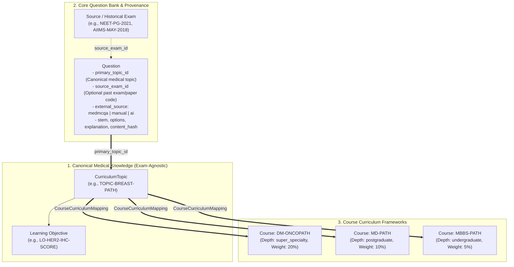
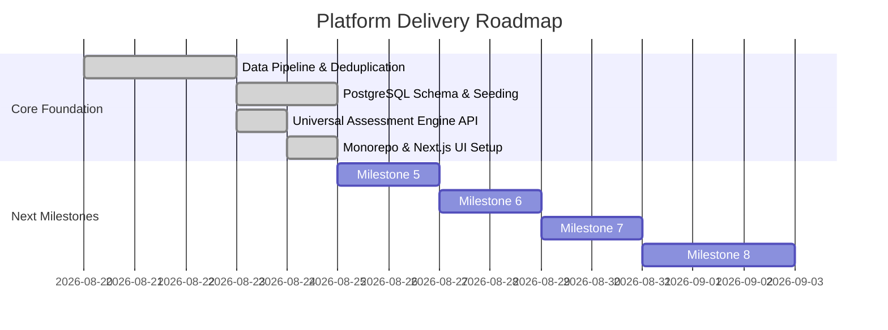

# DocEdge — Medical Exam AI Platform

[](https://www.postgresql.org/)
[](https://www.python.org/)
[](https://bun.sh/)
[](https://nextjs.org/)
[](https://github.com/tsdown/tsdown)
[](https://www.docker.com/)

> **Scalable AI-assisted medical examination and question bank platform.**  
> Initial focus: **Pathology** (Postgraduate/Super-Specialty preparation for **DM/DrNB Oncopathology**, **MD Pathology**, **NEET-PG**, and **INI-CET**).

---

## 1. Project Overview

Medical Exam AI is an educational platform designed to provide rigorous, evidence-backed mock examinations and question-bank analytics for medical trainees and residency candidates.

### Three-Tier Domain Architecture

The platform cleanly decouples medical knowledge from educational curricula and historical question provenance:



1. **Canonical Medical Taxonomy (`CurriculumTopic`)**: Exam-agnostic medical hierarchy:
   $$\text{Speciality} \longrightarrow \text{Subject} \longrightarrow \text{Topic} \longrightarrow \text{Subtopic} \longrightarrow \text{Learning Objective}$$
2. **Course Curriculum (`Course` & `CourseCurriculumMapping`)**: Academic programs (`MBBS`, `MD`, `DM`, `NEET-PG`) declare required topics with course-specific depth expectations (`undergraduate`, `postgraduate`, `super_specialty`) and exam weightages.
3. **Question Provenance (`source_exam_id` & `external_source`)**: Historical past-paper provenance is tracked without artificially restricting questions to a single syllabus.

---

## 2. Monorepo Structure

The platform is structured as a **Bun-powered monorepo** with shared typed packages and isomorphic APIs:

```
medical-learning-intelligence/
├── package.json                  # Root Bun workspace configuration
├── bunfig.toml                   # Bun package manager configuration
│
├── packages/
│   ├── shared/                   # @medical/shared (TS Types & Zod Schemas)
│   │   ├── src/
│   │   │   ├── types/            # Question, Topic, Assessment, Scoring models
│   │   │   ├── schemas/          # Zod validation schemas
│   │   │   └── index.ts
│   │   └── tsdown.config.ts      # Rolldown-powered library bundler (dual ESM/CJS)
│   │
│   └── api-client/               # @medical/api-client (Isomorphic HTTP API SDK)
│       ├── src/
│       │   ├── client.ts         # Base HTTP client with error handling
│       │   ├── assessments.ts    # Endpoints matching FastAPI backend
│       │   └── index.ts
│       └── tsdown.config.ts
│
├── apps/
│   ├── web/                      # Next.js 14 Web Portal (Admin + Student)
│   │   ├── src/
│   │   │   ├── app/
│   │   │   │   ├── page.tsx                          # Overview & Launchpad
│   │   │   │   ├── student/page.tsx                  # Student Practice & 1-Click Presets
│   │   │   │   ├── student/exam/[attemptId]/page.tsx # Timed Exam Runner & Palette
│   │   │   │   ├── student/results/[attemptId]/page.tsx # Diagnostic Scorecard
│   │   │   │   ├── student/review/[attemptId]/page.tsx  # Ground Truth & Citations Review
│   │   │   │   └── admin/page.tsx                    # Question Bank Curation Portal
│   │   │   ├── components/ui/    # Clean Shadcn UI (Button, Card, Badge, Progress, Separator)
│   │   │   └── styles/globals.css # Dark-mode medical theme tokens & glassmorphism
│   │
│   └── student-native/           # React Native / Expo workspace scaffold
│       └── src/index.ts          # Ready to consume @medical/shared and @medical/api-client
│
├── backend/                      # FastAPI Universal Assessment Engine (Port 8000)
│   ├── api/
│   │   ├── main.py               # Main FastAPI app & CORS middleware
│   │   └── routes/assessments.py # Presets, attempt runner sync, scoring & reviews
│   └── services/                 # AssessmentService business logic
│
├── database/                     # PostgreSQL 16 schema & SQLAlchemy models
├── data/                         # Data pipeline storage (raw/ & processed/)
└── scripts/                      # Data pipeline & DB seeders
```

---

## 3. Currently Implemented Capabilities

- **MedMCQA Pathology Ingestion Pipeline**: Ingestion and normalization of **15,526** Pathology questions (15,221 labeled questions with 98.04% explanation coverage).
- **Universal Assessment Engine (FastAPI)**: Complete backend for 1-click exam presets (*NEET-SS Oncopathology*, *NEET-PG Sprint*, *Daily Dose*), sub-second heartbeat state sync, and +4 / -1 scoring computation.
- **Next.js Web Client (`apps/web`)**:
  - **Launchpad**: Interactive overview with live platform stats and exam triggers.
  - **Student Hub**: 1-click test launcher and instant attempt creation.
  - **Active Timed Exam Runner**: Live countdown timer, Question Palette matrix, response sync, marked-for-review toggle, and submission modal.
  - **Diagnostic Scorecard**: Raw marks (+4 / -1 penalties), accuracy %, time spent, and topic mastery progress bars with celebration confetti.
  - **Question Review**: Side-by-side ground truth vs student answer highlighting with *Robbins & Cotran* and *WHO Blue Books* citations.
  - **Admin Curation Portal**: Question bank search, topic filtering, status transitions, and duplicate cluster detection.
- **`tsdown` (Rolldown) Library Bundling**: Lightning-fast build pipeline for `@medical/shared` and `@medical/api-client` producing dual ESM (`.mjs`) / CJS (`.cjs`) and `.d.ts` types.
- **Zero Data-Loss Deduplication**: SHA-256 content hashing and normalized stem clustering without discarding records.
- **PostgreSQL 16 Persistence Layer**: Full schema with custom ENUMs, JSONB options/metadata, and indexed relationships.

---

## 4. Quickstart & Local Development

### Prerequisites
- [Docker Desktop](https://www.docker.com/products/docker-desktop/)
- Python 3.11+
- [Bun](https://bun.sh/) (`powershell -c "irm bun.sh/install.ps1 | iex"`)

### Step 1: Start Infrastructure (PostgreSQL & Redis)
```bash
docker compose -f infrastructure/docker-compose.yml up -d
```

### Step 2: Seed Database & Questions
```bash
# Seeds courses, users, and imports the full 15,526 question bank
python scripts/import_to_db.py
```

### Step 3: Run FastAPI Backend
```bash
python -m uvicorn backend.api.main:app --reload --port 8000
```
Backend API docs available at `http://localhost:8000/docs`.

### Step 4: Run Next.js Frontend (apps/web)
```bash
# From workspace root:
bun dev:web

# Or from apps/web:
cd apps/web
bun dev
```
Frontend portal available at `http://localhost:3000`.

---

## 5. Next Steps & Roadmap



### Immediate Next Steps:
1. **Milestone 5 — PubMedBERT ML Prediction Service**:
   - Python FastAPI service running `jamezoon/medmcqa-pubmedbert-mcqa`.
   - Prediction endpoint returning predicted choice and model confidence probabilities.
   - Evaluation benchmarking against the 15,526 Pathology questions.
2. **Question Reporting & Editorial Feedback Loop**:
   - Enable students to flag incorrect explanations, ambiguity, or poor phrasing directly from the review screen.
   - Admin resolution desk to edit, retire, or approve corrected questions.
3. **Spaced Repetition & Adaptive Practice**:
   - Resident performance analytics (weakest topics, time management curves).
   - Adaptive revision drills prioritizing previously missed questions.
4. **Mobile Client (`apps/student-native`)**:
   - Initialize Expo Router app for iOS & Android.
   - Implement offline question caching (SQLite/MMKV) and push notifications for daily revision doses.

---

## 6. License & Medical Disclaimer

This platform is developed for medical education and examination preparation. Educational content and question banks do not constitute autonomous clinical diagnostic advice.