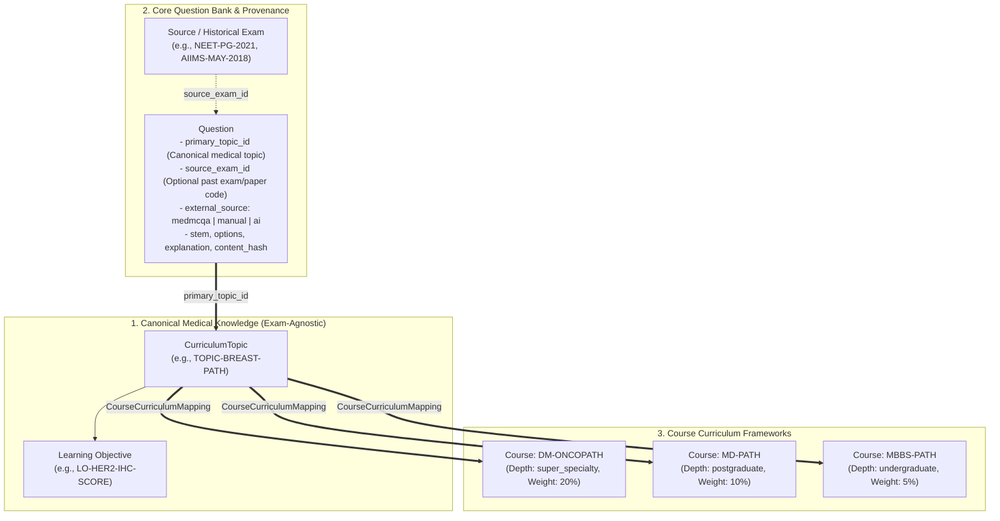

# Medical Exam AI Platform

[](https://www.postgresql.org/)
[](https://www.python.org/)
[](https://www.sqlalchemy.org/)
[](https://www.docker.com/)

> **Scalable AI-assisted medical examination and question bank platform.**  
> Initial focus: **Pathology** (Postgraduate/Super-Specialty preparation for **DM/DrNB Oncopathology**, **MD Pathology**, **NEET-PG**, and **MBBS**).

---

## 1. Project Overview

Medical Exam AI is an educational platform designed to provide rigorous, evidence-backed mock examinations and question-bank analytics for medical trainees and residency candidates.

### Three-Tier Domain Architecture

The platform cleanly decouples medical knowledge from educational curricula and historical question provenance:



1. **Canonical Medical Taxonomy (`CurriculumTopic`)**: Exam-agnostic medical hierarchy:
   $$\text{Speciality} \longrightarrow \text{Subject} \longrightarrow \text{Topic} \longrightarrow \text{Subtopic} \longrightarrow \text{Learning Objective}$$
2. **Course Curriculum (`Course` & `CourseCurriculumMapping`)**: Academic programs (`MBBS`, `MD`, `DM`, `NEET-PG`) declare required topics with course-specific depth expectations (`undergraduate`, `postgraduate`, `super_specialty`) and exam weightages.
3. **Question Provenance (`source_exam_id` & `external_source`)**: Historical past-paper provenance is tracked without artificially restricting questions to a single syllabus.

---

## 2. Currently Implemented Capabilities

- **MedMCQA Pathology Ingestion Pipeline**: Ingestion and normalization of **15,526** Pathology questions (15,221 labeled questions with 98.04% explanation coverage).
- **Zero Data-Loss Deduplication**: SHA-256 content hashing and normalized stem clustering without discarding records.
- **Universal Multi-Source Ingestion Engine**: Extensible intake adapter for CSV/Excel spreadsheets, Google Forms, Manual entry, and AI question candidates.
- **PostgreSQL 16 Persistence Layer**: Full schema with custom ENUMs, JSONB options/metadata, and indexed relationships.
- **Authoritative Source Hierarchy**: Reference models supporting textbook citations (*Robbins*, *WHO Blue Books*, *Sternberg*, *Rosai & Ackerman*, *Dabbs IHC*, *Koss Cytology*) down to chapter, page, and chunk.
- **Test Suite**: Automated integration and unit tests covering schema creation, cross-course mappings, and ingestion channels.

---

## 3. Quickstart & Local Development

### Prerequisites
- [Docker Desktop](https://www.docker.com/products/docker-desktop/)
- Python 3.11+

### Step 1: Clone & Configure Environment
```bash
git clone <your-repository-url>
cd medical-exam-ai

# Copy environment template
cp .env.example .env
```

### Step 2: Start Infrastructure (PostgreSQL & Redis)
```bash
docker compose -f infrastructure/docker-compose.yml up -d
```

### Step 3: Install Dependencies & Run Tests
```bash
pip install -r requirements.txt  # or install sqlalchemy psycopg2-binary python-dotenv
python -m unittest discover tests
```

### Step 4: Seed Curriculum & Import Questions
```bash
# Seeds courses, users, and imports the full 15,526 question bank
python scripts/import_to_db.py
```

---

## 4. Dataset Reproduction Workflow

Raw external datasets are excluded from Git for repository hygiene. To reproduce the dataset locally:

```bash
# 1. Download official MedMCQA splits into data/raw/medmcqa/
python scripts/import_medmcqa.py

# 2. Run extraction, normalization, and deduplication
python scripts/run_pipeline.py
```
Detailed data reproduction instructions can be found in [data/README.md](file:///R:/Repositories/medical-exam-ai/data/README.md).

---

## 5. Repository Structure

```
medical-exam-ai/
├── README.md
├── AGENTS.md
├── .gitignore
├── .env.example
│
├── docs/
│   ├── PRD.md                  # Product requirements document
│   ├── ARCHITECTURE.md         # System architecture & engineering guidelines
│   ├── DATA_MODEL.md           # Entity-relationship data model specification
│   ├── DATA_SOURCES.md         # Authoritative medical sources & provenance rules
│   └── ROADMAP.md              # 15-day milestone roadmap & future vision
│
├── database/
│   ├── db.py                   # Engine & session management with .env loading
│   ├── models.py               # SQLAlchemy 2.0 declarative ORM models
│   └── schema.sql              # Production PostgreSQL 16 schema & DDL
│
├── backend/
│   └── ingestion/
│       └── universal_ingestor.py # Universal multi-channel ingestion engine
│
├── scripts/
│   ├── import_medmcqa.py       # Raw MedMCQA split downloader
│   ├── extract_pathology.py    # Pathology subject extractor
│   ├── normalize_medmcqa.py    # Text sanitization & canonical mapper
│   ├── deduplicate_questions.py# SHA-256 duplicate signal clustering
│   ├── run_pipeline.py         # End-to-end dataset generation pipeline
│   ├── seed_curriculum.py      # Authoritative sources & taxonomy seeder
│   ├── import_to_db.py         # High-performance DB importer
│   └── ingest_cli.py           # CLI tool for CSV, Google Forms & manual intake
│
├── tests/
│   ├── test_pipeline.py        # Pipeline & normalization tests
│   ├── test_database.py        # Database schema & relationship tests
│   └── test_universal_ingestion.py # Multi-channel intake tests
│
├── data/
│   ├── README.md               # Data reproduction & attribution guide
│   ├── raw/medmcqa/            # (Ignored) Raw Parquet splits
│   └── processed/pathology/    # (Ignored) Processed JSONL datasets
│
└── infrastructure/
    └── docker-compose.yml      # PostgreSQL 16 (pgvector) + Redis 7 compose
```

---

## 6. Milestone Roadmap

- [x] **Milestone 1**: MedMCQA Pathology Data Pipeline & Normalization
- [x] **Milestone 2**: PostgreSQL 16 Database, Schema, & Curriculum Seeding
- [x] **Milestone 3**: Domain Decoupling (Taxonomy vs Curriculum vs Provenance)
- [x] **Milestone 4**: Repository Stabilization & Baseline GitHub Preparation
- [ ] **Milestone 5**: Python ML Signal Service (PubMedBERT MCQA prediction endpoint)
- [ ] **Milestone 6**: Question Bank & Admin Review UI (Next.js + TypeScript)
- [ ] **Milestone 7**: Timed Mock Exam Engine & Student Scoring Interface
- [ ] **Milestone 8**: Resident Performance Analytics & Question Reporting Loop

---

## 7. License & Medical Disclaimer

This platform is developed for medical education and examination preparation. Educational content and question banks do not constitute autonomous clinical diagnostic advice.