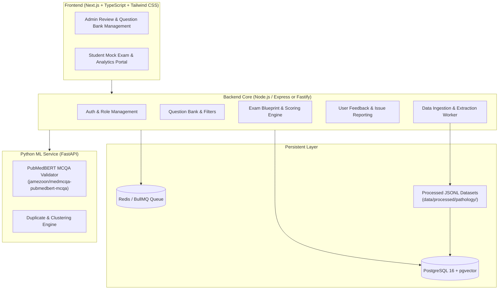

# Medical Exam AI — Architecture Specification

## 1. System Architecture

The Medical Exam AI Platform is architected as a modular monolith with isolated specialized ML services.

---

## 2. Ingestion & Extraction Pipeline

The pipeline ingests raw datasets (MedMCQA), isolates Pathology questions, normalizes the records to the unified domain schema, computes duplicate clusters without data loss, and outputs clean JSONL files ready for database import.

### Pipeline Stages

1. **Ingestion (`scripts/import_medmcqa.py`)**:
   - Downloads immutable raw Parquet splits (`train.parquet`, `validation.parquet`, `test.parquet`).
2. **Extraction (`scripts/extract_pathology.py`)**:
   - Filters rows where `subject_name == 'Pathology'`.
   - Preserves 100% of rows (15,526 questions total: 14,884 train, 337 validation, 305 test).
3. **Normalization (`scripts/normalize_medmcqa.py`)**:
   - Maps raw fields to the `Question` model.
   - Cleans Unicode/whitespace while preserving medical symbols.
   - Implements topic decoupling (`topic_name_original`, `topic_name_normalized`, `topic_mapping_status = 'UNMAPPED' | 'RAW_ONLY'`).
   - Computes deterministic UUIDs and SHA-256 content hashes.
4. **Duplicate Clustering (`scripts/deduplicate_questions.py`)**:
   - Clusters near/exact duplicate questions and attaches cluster signals without dropping any records.
5. **JSONL Export (`scripts/run_pipeline.py`)**:
   - Generates split-specific and aggregated `.jsonl` files plus `summary_report.json`.

---

## 3. Engineering Guidelines & Constraints

1. **Three-Tier Domain Decoupling**:
   - **Canonical Taxonomy**: `questions.primary_topic_id` is the exam-agnostic medical truth.
   - **Curriculum Mapping**: `course_curriculum_mappings` connects canonical topics to courses with specific depth (`undergraduate`, `postgraduate`, `super_specialty`) and weightages.
   - **Provenance**: `questions.source_exam_id` and `external_source` capture historical origin (e.g. past paper tags, MedMCQA), never confused with target course syllabus.
2. **Immutable Raw Data**: Raw datasets in `data/raw/` are strictly read-only.
3. **Zero Silent Deletion**: Duplicate hashes are stored as validation signals; records are preserved faithfully.
4. **Decoupled Curriculum**: Raw topic names from source datasets are kept as source metadata; curriculum hierarchy is defined independently.
5. **No Hallucinated Citations**: Reference provenance is tracked explicitly; AI-inferred evidence is strictly marked `AI_SUGGESTED`.
6. **Modular ML Isolation**: Machine learning services run in a lightweight Python FastAPI service, cleanly decoupled from the web application.
