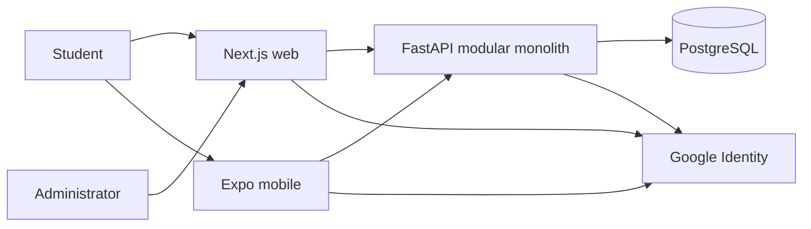
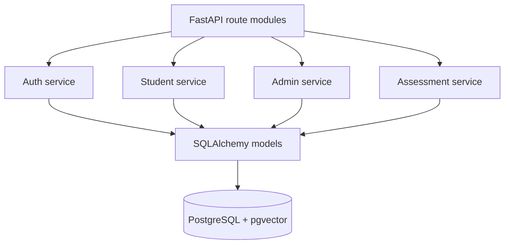

# Architecture Overview

## Architectural style

DocEdge AI is a modular monolith with two user-facing clients. Business rules,
authorization and persistence are centralized in a Python FastAPI backend.
The web and mobile clients share TypeScript contracts and API calls but retain
platform-specific presentation and identity adapters.

## Runtime boundaries

| Boundary | Responsibility | Source |
|---|---|---|
| Next.js web | Landing, admin and browser student experience | `apps/web` |
| Expo mobile | Native student experience and native OAuth adapter | `apps/mobile` |
| Shared contracts | Domain types and validation schemas | `packages/shared` |
| Shared API client | Typed HTTP calls and session header integration | `packages/api-client` |
| FastAPI | Authentication, authorization, students, administration, questions and assessments | `backend` |
| Persistence | SQLAlchemy models, PostgreSQL sessions and Alembic migrations | `database`, `alembic` |
| Data pipeline | Reproducible extraction, normalization and ingestion | `scripts`, `backend/ingestion` |

`apps/student-native` is a historical prototype workspace. `apps/mobile` is the
active native application; final removal or consolidation belongs to M12.

## Backend modules

The API remains one deployable container. Route modules delegate to service
modules rather than becoming independent network services.

## Core invariants

1. Backend authorization is authoritative; hidden UI is not access control.
2. PostgreSQL is the system of record and Alembic owns schema evolution.
3. Raw datasets remain immutable and imports preserve external identifiers.
4. Curriculum, canonical medical taxonomy and source provenance are separate.
5. AI-suggested evidence is never represented as human-verified evidence.
6. AI-generated questions are not published without the required review state.
7. Google clients acquire credentials differently, but the backend verifies all
   accepted Google ID-token audiences.
8. Medical content is educational and not an autonomous diagnostic service.

## Environments

- **Local:** Docker PostgreSQL/Redis, local FastAPI, Next.js and Expo.
- **Preview:** Vercel preview plus EAS preview builds against an explicitly
  configured backend environment.
- **Production alpha:** Vercel web, Render API, Neon PostgreSQL and EAS builds.

See [deployment view](architecture/DEPLOYMENT_VIEW.md) and
[deployment runbook](DEPLOYMENT.md) for operational detail.

## Future boundaries

Redis-backed jobs, evidence retrieval and the PubMedBERT validator remain
extension points. They become separate deployables only when workload isolation
or scaling provides a measured benefit.
