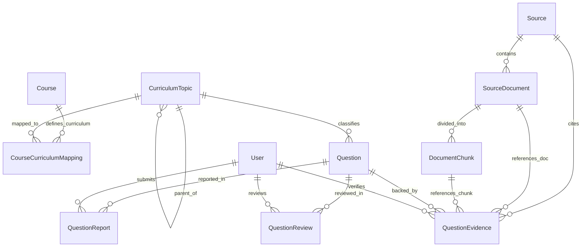

# Medical Exam AI — Data Model Specification

## 1. Three-Tier Domain Architecture Overview

The platform strictly decouples **Medical Knowledge**, **Educational Curricula**, and **Historical Question Provenance**:

1. **Tier 1: Canonical Medical Knowledge Taxonomy (`CurriculumTopic`)**:
   - Represents exam-agnostic medical science:
     $$\text{Speciality} \longrightarrow \text{Subject} \longrightarrow \text{Topic} \longrightarrow \text{Subtopic} \longrightarrow \text{Learning Objective}$$
   - Every question has one canonical medical classification via `primary_topic_id`.
2. **Tier 2: Educational Programs & Curricula (`Course` & `CourseCurriculumMapping`)**:
   - Academic programs (`MBBS Pathology`, `MD Pathology`, `DM Oncopathology`, `NEET-PG`) define their scope by mapping to canonical topics with course-specific `depth_level` (`undergraduate`, `postgraduate`, `super_specialty`), `exam_weightage`, and CBME/board competency codes.
   - Allows a single question to automatically serve multiple courses based on its topic and difficulty.
3. **Tier 3: Question Provenance & Source Exams (`source_exam_id` & `external_source`)**:
   - Questions track their historical origin (e.g. `external_source = 'medmcqa'`, `source_exam_id = 'NEET-PG-2021'` or `AIIMS-MAY-2018`).
   - Questions are never assigned to an academic course simply because they belong to a medical specialty.
4. **Hierarchical Source & Document Provenance (`sources` $\rightarrow$ `source_documents` $\rightarrow$ `document_chunks`)**:
   - Supports multi-level citation and RAG vector search from authoritative works (e.g. *Robbins*, *WHO Blue Books*) down to specific volumes, chapters, pages, and extracted text chunks.

---

## 2. Entity-Relationship Diagram



---

## 3. Core Entities

### 3.1 `User` Entity

| Field | Type | Description |
|---|---|---|
| `id` | `UUID` | Primary Key. |
| `email` | `VARCHAR(255)` | Unique email address. |
| `name` | `VARCHAR(255)` | User full name. |
| `role` | `ENUM` | Roles: `'ADMIN'`, `'USER'`, `'REVIEWER'`, `'EDUCATOR'`. |
| `password_hash` | `VARCHAR(255)` | Hashed password credential. |
| `is_active` | `BOOLEAN` | Account status flag. |
| `created_at` | `TIMESTAMPTZ` | Registration timestamp. |
| `updated_at` | `TIMESTAMPTZ` | Last update timestamp. |

---

### 3.2 `Course` Entity

Represents educational programs, degrees, board exams, and competitive entrance frameworks.

| Field | Type | Description |
|---|---|---|
| `id` | `UUID` | Primary Key. |
| `code` | `VARCHAR(50)` | Unique course code (e.g. `'DM-ONCOPATH'`, `'MD-PATH'`, `'NEET-PG'`, `'MBBS-PATH'`). |
| `name` | `VARCHAR(255)` | Course title (e.g. `'DM / DrNB Oncopathology'`). |
| `target_audience` | `VARCHAR(100)` | e.g. `'Super-Specialty'`, `'Postgraduate'`, `'Undergraduate'`. |
| `description` | `TEXT` | Syllabus and curriculum overview. |
| `is_active` | `BOOLEAN` | Course active state. |
| `created_at` | `TIMESTAMPTZ` | Creation timestamp. |
| `updated_at` | `TIMESTAMPTZ` | Last update timestamp. |

---

### 3.3 `CurriculumTopic` Entity (Canonical Knowledge Domain Tree)

Represents pure medical knowledge, independent of any individual course or exam:
$$\text{Speciality} \longrightarrow \text{Subject} \longrightarrow \text{Topic} \longrightarrow \text{Subtopic} \longrightarrow \text{Learning Objective}$$

| Field | Type | Description |
|---|---|---|
| `id` | `UUID` | Primary Key. |
| `parent_id` | `UUID` | Foreign Key $\rightarrow$ `curriculum_topics.id` (self-referential). `NULL` for root. |
| `code` | `VARCHAR(100)` | Unique taxonomy code (e.g. `'TOPIC-BREAST-PATH'`, `'SUBTOPIC-HER2-TESTING'`). |
| `name` | `VARCHAR(255)` | Node name (e.g. `'HER2/neu IHC & FISH Testing'`). |
| `description` | `TEXT` | Scope and concept description. |
| `level` | `ENUM` | `'speciality'`, `'subject'`, `'topic'`, `'subtopic'`, `'learning_objective'`. |
| `display_order` | `INT` | Sorting order within parent node. |
| `metadata` | `JSONB` | Extensible metadata. |
| `created_at` | `TIMESTAMPTZ` | Creation timestamp. |
| `updated_at` | `TIMESTAMPTZ` | Last update timestamp. |

---

### 3.4 `CourseCurriculumMapping` Entity (Cross-Course Topic Sharing)

Allows a single canonical topic (e.g. `TOPIC-BREAST-PATH`) to be shared across courses with different depth expectations and weightages:

| Field | Type | Description |
|---|---|---|
| `id` | `UUID` | Primary Key. |
| `course_id` | `UUID` | Foreign Key $\rightarrow$ `courses.id`. |
| `topic_id` | `UUID` | Foreign Key $\rightarrow$ `curriculum_topics.id`. |
| `depth_level` | `ENUM` | `'undergraduate'`, `'postgraduate'`, `'super_specialty'`, `'general'`. |
| `exam_weightage` | `FLOAT` | Target percentage in mock exams (e.g. `0.20` for 20%). |
| `is_core` | `BOOLEAN` | Core required module vs elective. |
| `competency_code` | `VARCHAR(100)` | e.g. `'PE9.1'` for NMC CBME, or `'DM-BR-01'`. |
| `learning_objectives`| `JSONB` | Specific LOs targeted for this course level. |
| `created_at` | `TIMESTAMPTZ` | Creation timestamp. |

---

### 3.5 `Source`, `SourceDocument`, and `DocumentChunk` Entities

Authoritative reference hierarchy from author/work down to chunks for RAG:

```
Source (e.g., Robbins & Cotran Pathologic Basis of Disease)
  └── SourceDocument (e.g., 10th Edition, Chapter 6: Neoplasia)
        └── DocumentChunk (e.g., Chunk #12: HER2 IHC ASCO/CAP scoring criteria + Vector Embedding)
```

#### `Source`
- `id`, `short_name`, `title`, `author`, `edition`, `year`, `publisher`, `source_type` (`textbook`, `who_classification`, `guideline`, `journal_article`).

#### `SourceDocument`
- `id`, `source_id`, `title`, `edition`, `volume`, `chapter_number`, `page_start`, `page_end`, `file_path`, `file_hash`, `metadata`.

#### `DocumentChunk`
- `id`, `document_id`, `chunk_index`, `section_heading`, `page_number`, `content`, `content_hash`, `metadata` (future pgvector embedding column).

---

### 3.6 `Question` Entity (Core MCQ Domain Model)

| Field | Type | Description |
|---|---|---|
| `id` | `UUID` | Primary Key. Deterministic UUID for external sources. |
| `external_source` | `VARCHAR(50)` | Origin tag: `'medmcqa'`, `'csv_import'`, `'google_forms'`, `'manual_admin'`, `'ai_generator'`. |
| `external_source_id` | `VARCHAR(100)` | Unique identifier with origin prefix (e.g. `medmcqa-af913acc-...`). |
| `source_exam_id` | `VARCHAR(100)` | Optional historical exam / paper code (e.g. `'NEET-PG-2021'`, `'AIIMS-MAY-2018'`). |
| `speciality` | `VARCHAR(100)` | e.g. `'Pathology'`. |
| `subject` | `VARCHAR(100)` | e.g. `'Pathology'`. |
| `topic_name_original` | `VARCHAR(255)` | Raw topic string from source. |
| `topic_name_normalized` | `VARCHAR(255)` | Normalized topic string. |
| `topic_mapping_status` | `ENUM` | `'UNMAPPED'`, `'RAW_ONLY'`, `'MAPPED'`. |
| `primary_topic_id` | `UUID` | Foreign Key $\rightarrow$ `curriculum_topics.id` (Canonical Medical Classification). |
| `learning_objective` | `TEXT` | Tested educational objective. |
| `question_type` | `ENUM` | `'single_best_answer'`, `'multiple_choice'`, `'case_based'`. |
| `stem` | `TEXT` | Question text with medical Unicode symbols preserved. |
| `options` | `JSONB` | Structured array: `[{"key": "A", "text": "..."}, ...]`. |
| `correct_option` | `CHAR(1)` | `'A'`, `'B'`, `'C'`, `'D'` (or `NULL`). |
| `correct_index` | `INT` | `0`, `1`, `2`, `3` (or `-1` if unlabeled). |
| `is_labeled` | `BOOLEAN` | Whether ground truth is present. |
| `explanation` | `TEXT` | Detailed clinical explanation. |
| `difficulty` | `ENUM` | `'easy'`, `'medium'`, `'hard'`. |
| `cognitive_level` | `ENUM` | `'recall'`, `'understanding'`, `'application'`, `'analysis'`. |
| `status` | `ENUM` | `'IMPORTED'`, `'GENERATED'`, `'AI_REVIEW'`, `'HUMAN_REVIEW'`, `'APPROVED'`, `'REJECTED'`, `'REPORTED'`, `'RETIRED'`. |
| `quality_score` | `FLOAT` | Composite evaluation score (0.0 to 1.0). |
| `content_hash` | `CHAR(64)` | SHA-256 hash of normalized stem + normalized options for duplicate detection. |
| `norm_stem_hash` | `CHAR(64)` | SHA-256 hash of normalized stem for similarity clustering. |
| `duplicate_signals` | `JSONB` | Duplicate cluster annotations. |
| `metadata` | `JSONB` | Origin metadata (submitter email, timestamp, AI model name, blueprint). |
| `created_by` | `VARCHAR(100)` | Creator tag. |
| `created_at` | `TIMESTAMPTZ` | Creation timestamp. |
| `updated_at` | `TIMESTAMPTZ` | Modification timestamp. |

---

### 3.7 `QuestionEvidence` Entity

Links a question to an authoritative source, document, or specific text chunk:

| Field | Type | Description |
|---|---|---|
| `id` | `UUID` | Primary Key. |
| `question_id` | `UUID` | Foreign Key $\rightarrow$ `questions.id`. |
| `source_id` | `UUID` | Foreign Key $\rightarrow$ `sources.id`. |
| `document_id` | `UUID` | Foreign Key $\rightarrow$ `source_documents.id` (optional). |
| `chunk_id` | `UUID` | Foreign Key $\rightarrow$ `document_chunks.id` (optional). |
| `volume` | `VARCHAR(50)` | Volume reference. |
| `chapter` | `VARCHAR(100)` | Chapter title or number. |
| `page_range` | `VARCHAR(50)` | e.g. `'pg. 285-288'`. |
| `section` | `VARCHAR(150)` | Section heading. |
| `excerpt` | `TEXT` | Authoritative quote or excerpt. |
| `verification_status` | `ENUM` | `'AI_SUGGESTED'`, `'HUMAN_VERIFIED'`, `'REJECTED'`. |
| `confidence` | `FLOAT` | Confidence score (0.0 to 1.0). |
| `verified_by` | `UUID` | Foreign Key $\rightarrow$ `users.id`. |
| `verified_at` | `TIMESTAMPTZ` | Verification timestamp. |
| `created_at` | `TIMESTAMPTZ` | Creation timestamp. |

---

## 4. Planned Future Extensions (Educator & Curation Milestone)

### `question_courses` (Course-Specific Question Curation)
To allow educators to curate custom question subsets per examination without modifying canonical medical taxonomy:
- `question_id` (FK $\rightarrow$ `questions.id`)
- `course_id` (FK $\rightarrow$ `courses.id`)
- `inclusion_status` (`INCLUDED`, `EXCLUDED`, `FLAGGED`)
- `priority` (`CORE`, `ELECTIVE`, `HIGH_YIELD`)
- `difficulty_override` (`easy`, `medium`, `hard`)
- `educator_notes`
