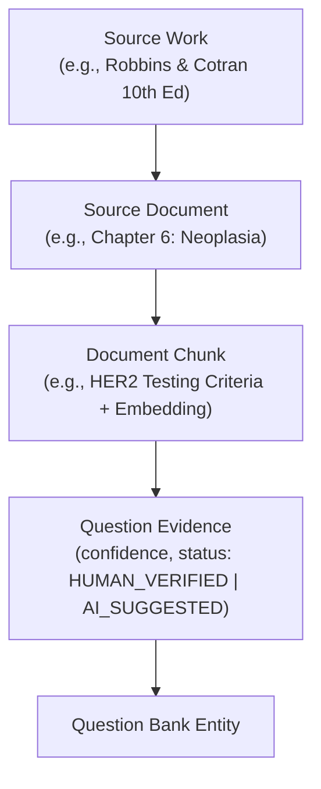

# Medical Exam AI — Data Sources & Provenance Policy

## 1. External Datasets

### MedMCQA (Medical Multiple Choice Question Answering)
- **Source**: [https://github.com/medmcqa/medmcqa](https://github.com/medmcqa/medmcqa)
- **Format**: Parquet / JSON splits (Train, Validation, Test).
- **Domain Coverage**: Broad Indian medical entrance exams (NEET-PG, AIIMS, PGI).
- **Pathology Subset Statistics**:
  - Total Pathology MCQs: **15,526**
  - Labeled MCQs: **15,221** (98.04% with explanations)
  - Raw Distinct Topic Labels: **231**
  - Deduplication Status: 0 duplicate IDs, 1,123 content duplicate clusters tracked via signals without data loss.

### Provenance & Citation Rules for MedMCQA:
1. **No Inferred Citations**: MedMCQA explanations contain conversational remarks (e.g. *"Ref: Robbins 9th ed"*). These are **never** converted into verified textbook citations automatically.
2. **Provenance Tracking**: Ingested questions are tagged with `external_source = 'medmcqa'` and `external_source_id = 'medmcqa-{original_id}'`.
3. **Immutability**: Raw MedMCQA files in `data/raw/medmcqa/` remain strictly read-only.

---

## 2. Authoritative Medical Reference Corpus

The platform models knowledge provenance down to editions, chapters, and vector chunks:

### Core Foundational Pathology Sources:
1. **Robbins & Cotran Pathologic Basis of Disease** (Kumar, Abbas, Aster — 10th Edition, Elsevier)
2. **WHO Classification of Tumours (Blue Books)** (World Health Organization / IARC — 5th Edition)
3. **Sternberg's Diagnostic Surgical Pathology** (Mills et al. — 7th Edition, Wolters Kluwer)
4. **Rosai and Ackerman's Surgical Pathology** (Goldblum et al. — 11th Edition, Elsevier)
5. **Diagnostic Immunohistochemistry: Theranostic and Genomic Applications** (Dabbs — 6th Edition, Elsevier)
6. **Koss' Diagnostic Cytology and Its Histopathologic Bases** (Koss, Melamed — 5th Edition, LWW)

---

## 3. Copyright & Legitimate Ingestion Policy

- **No Pirated Content**: The knowledge pipeline ingests legitimately obtained documents and open medical guidelines.
- **Verification Levels**:
  - `AI_SUGGESTED`: Evidence matched via semantic retrieval / RAG; requires human verification before promotion.
  - `HUMAN_VERIFIED`: Confirmed by a qualified pathologist/editor.
  - `REJECTED`: Inaccurate citation flagged during editorial review.
