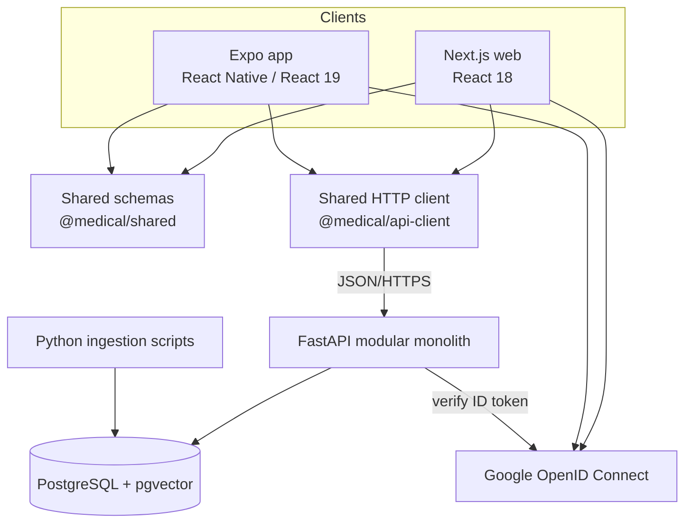
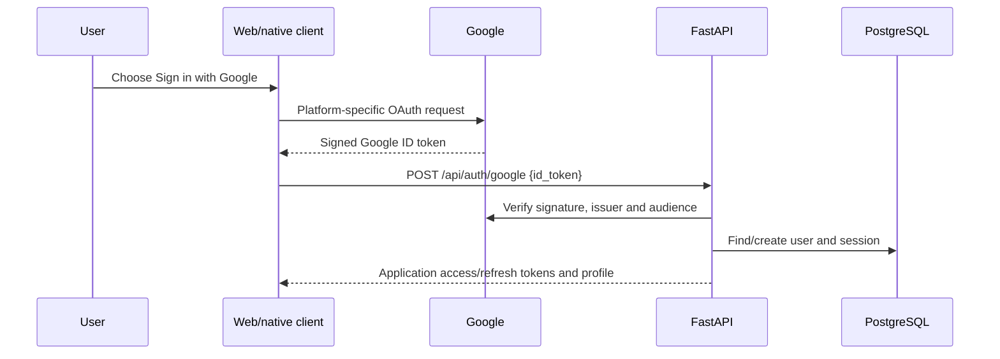

# Container View

"Container" here follows the C4 meaning: a separately runnable application or
data store, not necessarily a Docker container.

## Dependency rules

- Clients may depend on shared TypeScript packages; shared packages do not
  depend on a client.
- `@medical/shared` contains portable contracts and must not import browser or
  React Native APIs.
- `@medical/api-client` contains portable HTTP behavior. Platform session/token
  storage is injected by each client.
- React components are not currently shared across Next.js and React Native.
  M12 will review shared headless logic, tokens and component boundaries.
- Backend routes call backend services; clients never connect directly to the
  database.
- Ingestion code may populate PostgreSQL through controlled scripts but never
  mutates the immutable raw dataset.

## Authentication sequence

