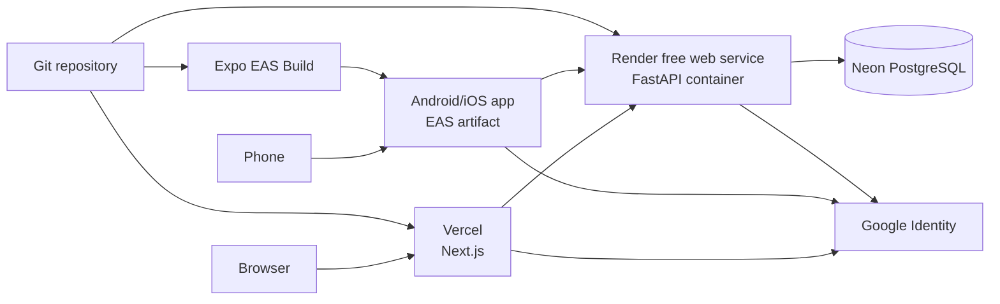

# Deployment View

## Production alpha

## Release responsibilities

| Target | Artifact/configuration | Important behavior |
|---|---|---|
| Vercel | `apps/web`, `apps/web/vercel.json` | Builds shared packages before Next.js |
| Render | `Dockerfile.backend`, `render.yaml` | Runs Alembic then starts Uvicorn |
| Neon | `DATABASE_URL` | Durable alpha database; SSL required |
| EAS | `apps/mobile/eas.json`, `app.json` | Builds signed native preview/production artifacts |
| Google | OAuth client configuration | Web origin plus platform package/bundle and signing identity |

## Operational constraints

- Render free services sleep after inactivity, so alpha cold starts are expected.
- Secrets live in provider environment configuration, never committed files.
- `NEXT_PUBLIC_*` and `EXPO_PUBLIC_*` values are browser/app-visible and must not
  contain secrets.
- Database migrations run before serving a new backend release.
- Do not remove the previous database until migration and application checks pass.

For commands and rollback steps, use [Deployment](../DEPLOYMENT.md).
