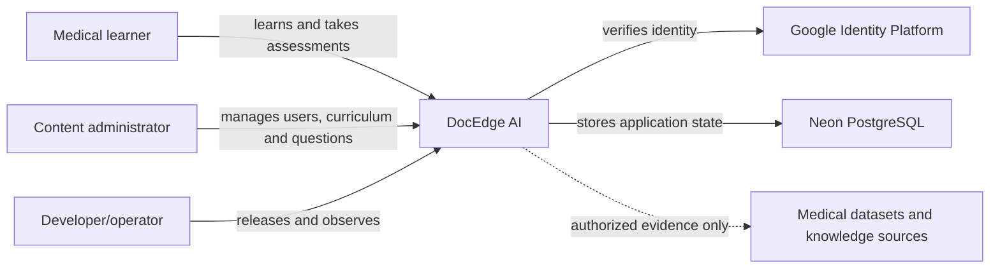

# System Context

## People

- **Student:** registers, completes onboarding, views entitled content, takes
  assessments and reports problematic questions.
- **Administrator:** manages users/roles/subscriptions and reviews question-bank
  content. Admin capability is enforced by backend authorization.
- **Developer/operator:** changes code, migrations and configuration, and owns
  deployment/restore procedures.

## External systems

- **Google Identity Platform:** issues ID tokens. Web, Android and iOS OAuth
  clients have distinct client IDs; the backend allowlists their audiences.
- **Neon:** durable managed PostgreSQL system of record for the alpha.
- **Vercel, Render and EAS:** deployment platforms, documented in the deployment
  view rather than modeled as product capabilities.
- **Medical sources:** imported only with legitimate access and explicit
  provenance. They are not runtime authorities for user identity or access.

## Trust boundary

Clients are untrusted. They may improve user experience by hiding inaccessible
actions, but FastAPI validates identity, role, entitlement and resource ownership
on every protected operation.
